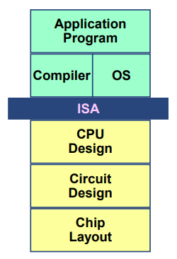
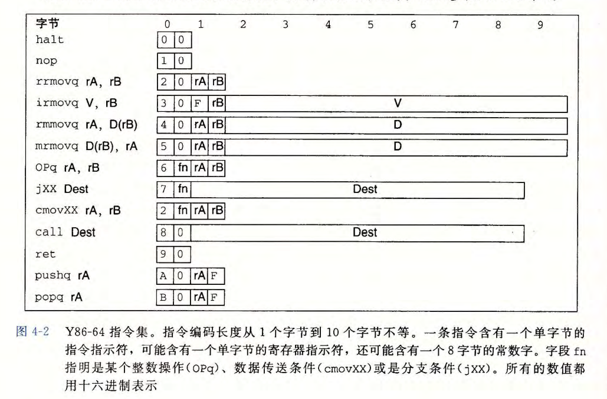

# 09 Processor Architecture I: ISA & Logic Design


## Part A 指令系统体系结构

### 一、ISA与计算机体系的联系

机器语言、汇编的程序级

* 处理器状态：寄存器、内存等
* 指令：指令的含义、指令的编码
* 抽象层概念：
  * 上层，如何对机器进行编程：将处理器执行指令的模式抽象成顺序执行（现代处理器实际工作方式为同时处理多条指令的不同部分）

硬件如何设计：硬件系统执行ISA指令的方式，学习处理器硬件设计。




为了讲课方便，自己制作一个“Y86-64”指令集：

### 二、自定义 Y86-64 指令系统体系结构

包含：

* 各种状态单元
* 指令集和指令的编码
* 编程规范
* 异常事件处理


#### 程序员可见的状态

Y86-64程序中的每条指令都会读取或修改处理器状态的某些部分，称为“程序员可见状态”。“程序员”：用汇编代码写程序的人 / 编译器

* **程序寄存器**：15个（不要`%r15`，以简化指令编码），每个存储8字节数据，最后一位用于特殊编码
  * `%rsp`存储栈指针，其他寄存器没有固定含义和固定值
* **条件码**：简单计算，只需ZF、SF、OF
* **程序计数器**：PC，存储当前正在执行的指令的地址
* **内存**：使用虚拟内存，字节数组，小端存储
* **程序状态码**：表明程序执行的总体状态，表明是正常运行还是出现了某种 **异常**。


#### Y86-64 指令

格式：

* 每条指令1-10字节，足够简单（比x86-64简单）

指令：

* `halt`：停止指令运行
  * x86-64中有与之相当的指令`hlt`，但是不准用：会导致整个操作系统体制运行
  * 
* `nop`：no operation
* `cmov`：条件传送指令，条件：`le, l, e, ne, g, ge`六个
* `movq`：`xxmovq`，表示源和目的：
  * 地址计算中**不支持第二变址寄存器和寄存器值的伸缩**
* `OPq`：整数操作指令，计算，只能操作寄存器数值，设置三个条件码
* `jXX`跳转指令，六个条件
* `call`、`ret`、`pushq`、`popq`和x86-64相同，对高级语言的支持




#### 指令编码

寄存器编码：

* 每个寄存器有四字节的ID，在x86-64中也是

* 15（0xF）为“无寄存器”

  

指令编码：

* 每条指令的第一个字节表明指令的类型，分为两个部分，高4位为 **代码** 部分，低四位为 **功能** 部分

  

  * 分支和传送的功能码0代表无条件（分支变为直接跳转，条件传送变为单纯的寄存器数据传送），非常简单
  
* 需要操作数的指令编码更长一些，可能有“附加的**寄存器指示符字节**”，指定一个或两个寄存器`rA, rB`。

  * 仅需一个寄存器操作数的指令（`irmovq`、`pushq`等）会将另一个寄存器指示符设置为0xF（图中的`F`）。

* 有些指令需要一个附加的4字节“**常数字**”。这个数能作为`irmovq`的立即数数据、`rmmovq`和`mrmovq`的地址指示符的偏移量、或者分支指令和调用指令的目的地址（这里用 **绝对地址**，不是PC相对，因为简单）。小端法存储。

指令集的重要性质：字节编码必须有唯一的解释：任意一个字节序列要么是一个唯一的指令序列的编码，要么是不合法的字节序列


#### RISC和CISC指令集

* CISC：复杂指令集计算机
  * 指令数量很多
  * 有些指令延迟很长
  * 编码长度可变
  * 寻址模式多
  * 可对内存操作数进行算数和逻辑运算
  * 对机器级程序，实现细节不可见
  * 有条件码
  * 用栈来存取过程参数和返回地址
* （早期的）RISC：
  * 指令数量少得多
  * 没有较长延迟的指令
  * 编码长度固定，通常为4字节
  * 简单寻址方式：基址和偏移量寻址
  * 只能对寄存器操作数进行算数和逻辑运算，允许使用内存引用的只有`load`和`store`指令
  * 对机器级程序，实现细节可见
  * 无条件码，需要明确的测试指令
  * 寄存器被用来存取过程参数和返回地址，通常处理器有更多的寄存器
* x86-64：披着CISC皮的RISC
* Y86-64：一样，两者结合


#### Y86-64异常

状态码Stat：描述程序执行的总体状态

* 1：AOK：正常操作
* 2：HLT：处理器执行了`halt`指令
* 3：ADR：遇到非法地址
* 4：INS：遇到非法指令

除了AOK外，程序都会停止执行。


#### Y86-64程序

**Y86-64程序栈**

* 栈顶存在`%rsp`中，为栈顶元素的地址
* 向下生长，向低地址生长
  * `pushq`时先减栈指针再赋值，`popq`时先赋值再加栈指针

**完整的程序文件**

包括数据和指令，**伪指令**指明应该将代码或数据放在什么位置、如何对齐


* `.pos 0`：从地址0处开始产生代码
* 初始化栈指针：程序保证栈不会增长的太大以至于覆盖了代码或其他程序数据


#### 指令详情

* `pushq %rsp`和`popq %rsp`在x86-64中是怎样的行为？

  `pushq %rsp`先存入`%rsp`，再将`%rsp`减八；

  `popq %rsp`先将`%rsp`加八，再将栈顶的值赋给`%rsp`（等价于直接将栈顶的值赋值给`%rsp`）

*  则 Y86-64 也采用相同的设定。

  


## Part B 逻辑设计和硬件控制语言HCL

* 大多数现代电路技术都是用信号线上的高电压和低电压来表示不同的位值
* **HCL**：硬件控制语言，用来描述不同处理器设计的控制逻辑。
* 实现数字系统需要的三个主要的部分：
  * 计算对位进行操作的函数的组合逻辑
  * 存储位的存储器单元
  * 控制存储器单元更新的时钟信号


### 一、逻辑门


1. 使用`&&`、`||`和`!`表示：只对单个位进行操作，而不是位向量
2. n路操作时还是写作多个二路运算符
3. 总是活动的：一旦一个门的输入变化了，在很短的时间内，输出就会相应的变化。


### 二、组合电路和HCL布尔表达式

**组合电路**：用很多逻辑门组合成的网（计算块），限制：

1. 每个逻辑门的输入必须是系统输入、存储器单元的输入或是某个逻辑门的输出
2. 两个或多个逻辑门的输出不能连接在一起：防止信号矛盾，产生不合法的电压或电路故障
3. 整体无环，防止计算歧义

与C逻辑表达式的区别：

1. 持续响应，而不是遇到时才求值
2. 只对0、1进行操作，C中0表示`false`，其他任何值表示`1`
3. C中逻辑表达式可能只被部分求值

常见部件：

* 检测位相等：`bool eq = (a && b) || (!a && !b)`
* **多路复用器**（MUX）：根据输入控制信号的值，从一组不同的数据中选一个，`bool out = (s && a) || (!s && b)`


### 三、字级的组合电路和HCL整数表达式

HCL中，为了简单，字级别信号都声明为int，不指定字的大小

1. 字级相等：`bool Eq = (A == B)`，64个位级相等加上一个64路的与门

2. 字级多路复用器：用 **情况表达式** 描述：

   ```
   [
   	select1 : expr1;
   	select2 : expr2;
   	.
   	.
   	.
   	selectk : exprk;
   ]
   ```

   同C的`switch`不同，不要求表达式之间互斥：顺序求值，第一个求值为1的会被选中：

   ```
   word Out = 
   [
   	s : A;
   	1 : B;
   ]
   ```

3. **算数/逻辑单元**（ALU）

   * 有三个输入：A、B数据输入，控制输入
   * 控制输入决定输出哪个计算结果：为了和Y86-64匹配，0为 X+Y，1为 Y-X，2为 X&Y，3为 X^Y


### 四、HCL集合关系

如解码器：通过一个两位的信号，产生两个一位的控制信号：

```
bool s1 = (code == 2) || (code == 3) # 01, 11
bool s0 = (code == 0) || (code == 1) # 00, 01
```

简记作：

```
bool s1 = code in { 2, 3 };
bool s0 = code in { 0, 1 };
```

判断集合关系的通用格式是`iexpr in { iexpr1, iexpr2, ..., iexprk }`，被测试的值`iexpr`和待匹配的值`iexpr1 ~ iexprk`都是整数表达式


### 五、存储器和时钟

**时序电路**：有状态，并在这个状态上进行计算的系统

存储器设备：

#### 时钟寄存器

简称寄存器：存储单个位或者字，时钟信号控制寄存器加载输入值

* 硬件里的寄存器：时钟寄存器；汇编码里的寄存器：CPU中可寻址的字（程序寄存器）

* 拥有一个输入信号，时钟的上升沿到来（时钟上升）时才会将输入加载到寄存器并输出，其他时候输出保持不变（输出当前状态）
* **时钟**：一个固定频率的方波发生器
* Y86-64用时钟处理器存储PC、CC和Stat


#### 随机访问存储器

简称内存：存储多个字，用地址选择该读还是该写哪个字，包括处理器的虚拟内存系统和包含程序寄存器的寄存器文件

* 寄存器文件：

  

  * 两读一写，多端口，允许同时进行多个读和写操作

  * 两个读端口：地址输入`srcA, srcB`和数据输出`valA, valB`

  * 写端口：地址输入`dstW`和数据输入`valW`

  * 时钟：控制向寄存器写入字

  * **读**：根据地址输入，在一定延迟后输出对应地址上的内容

  * **写**：时钟上升时，输入`valW`上的值会被写入到当前输入的`dstW`上的寄存器ID指示的程序寄存器；`dstW`为0xF时，不会写入任何寄存器

  * 在写的时候读那个内存：可以观察到一个旧值到新值的变化

**不是组合电路**：多个“边缘触发的锁存器（edge-triggered latch）”的集合，锁存器里有环路（为了存储数据）

* 例：边缘触发的异或锁存器

  


处理器中的随机访问存储器：存储程序数据


* 一个地址输入，一个写的数据输出，一个读的数据输出，读写逻辑和寄存器文件相同
* 无论读写，当地址输入不合法时（地址超出范围等），`error`信号会被设置为1
  * 信号由组合逻辑产生，不涉及保存任何状态

对应Y86-64的处理器还有另一个只读存储器，用来读指令；实际系统中会合并成一个具有双端口的存储器，一个用来读指令，另一个用来读或者写数据。
