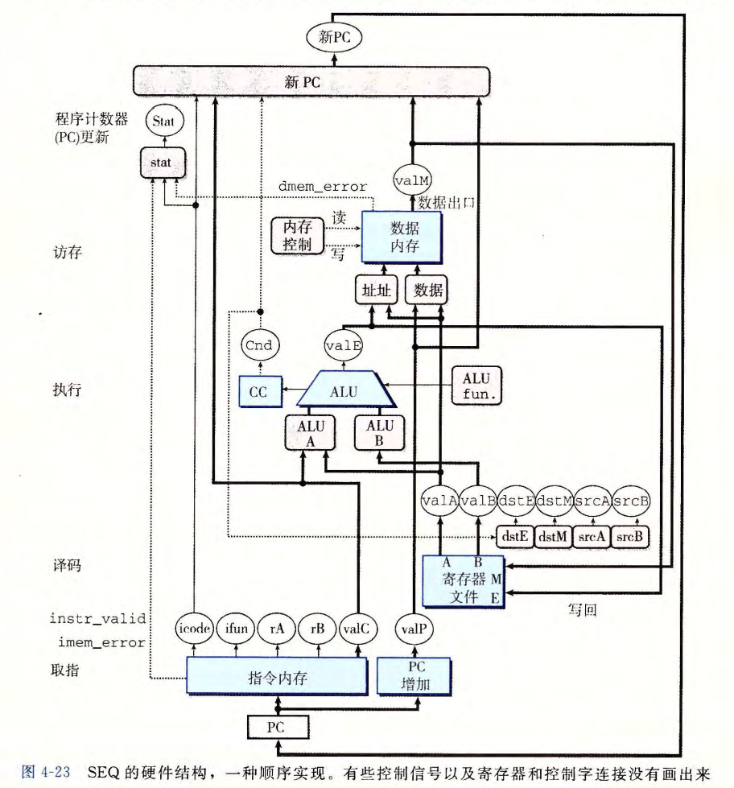

# 10 Processor Architecture SEQ: Sequential Implementation

## 构建模块

* 计算逻辑：ALU、MUX
  * 计算布尔代数，对输入变化连续地做出反应，操作数据并执行控制
* 存储单元：寄存器文件
  * 存储bit，分为可用地址表示的内存和无地址的寄存器，只在时钟上升沿时读取

## 将处理组织成阶段

* **取指**（fetch）：从内存中读取指令字节，地址为程序计数器（PC）的值。读取：

  * icode指令代码和ifun指令功能
  * rA、rB寄存器操作数指示符
  * 四字节常数字valC，按照顺序方式计算当前指令的下一条指令的地址valP：valP等于PC的值加上已取出指令的长度

* **译码**（decode）：从寄存器文件读入最多两个操作数，得到值valA和（或）valB

* **执行**（execute）：

  1. 执行指令（ifun）指明的操作、计算内存引用的有效地址、增加或减少栈指针等，得到valE
  2. 设置条件码、检验条件码：条件转移或跳转

* **访存**（memory）：将数据写入内存或从内存读出数据，值为valM

* **写回**（write back）：最多写两个结果到寄存器文件

* **更新PC**（PC update）：将PC设置成下一条指令的地址

  

## SEQ硬件结构：

SEQ：sequential，顺序的

* 状态：PC、CC、寄存器文件、内存
* 指令流：从PC指定的地址读入指令、在不同阶段中处理、更新PC

SEQ阶段的实现