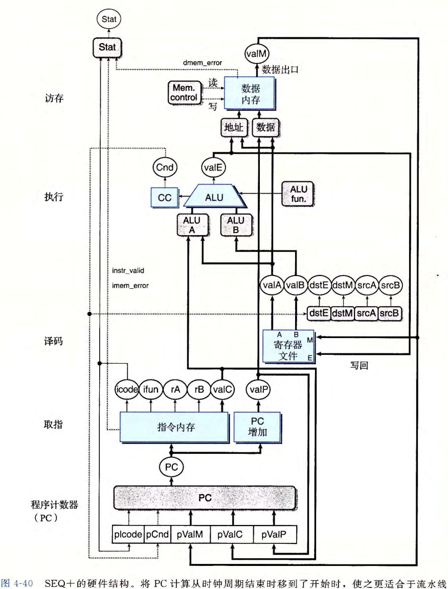

# Processor Architecture III PIPE: Pipelined Implementation


[TOC]


## Part 1 流水线的通用原理

**流水线化**：提高系统的**吞吐量**（单位时间内处理指令的总数），而轻微增加**延迟**（处理一条指令所需的时间）


### 一、计算流水线

假设组合逻辑需要300ps（皮秒），加载寄存器需要20ps，延迟为320ps，吞吐量为3.12GIPS（每秒十亿条指令）

假设将系统执行的计算分成三个阶段A、B、C，在每个阶段之间放入**流水线寄存器**：每个阶段需要100ps，则延迟为360ps，吞吐量为8.33GIPS

* 代价：硬件增加，延迟增加：增加的流水线寄存器带来额外的时间开销


### 二、详细说明


以240ps至360ps的活动为例：

|            |           A            |           B            |     C      | 1 Reg                      | 2 Reg            |
| :--------: | :--------------------: | :--------------------: | :--------: | -------------------------- | ---------------- |
| 时钟上升前 | I2计算完毕，I3到达输入 | I1计算完毕，I2到达输入 | I1到达输入 | 输出I1结果，I2结果到达输入 | I1结果到达输入   |
| 时钟上升时 |         加载I3         |         加载I2         |   加载I1   | 加载、输出I2结果           | 加载、输出I1结果 |

* 时钟上升前：结果值到达流水线寄存器
* 时钟上升时：改变寄存器状态，指令前进经过一个流水线阶段
* 减缓时钟不会影响流水线的行为：如果时钟太快，值可能会来不及通过组合逻辑
* 随着时钟方波周期性变化，不同指令会通过流水线的各个阶段、互不干扰


### 三、流水线的局限性

会影响流水线效率的因素：

1. 阶段划分不一致：运行时钟的速率由最慢的延迟限制，阶段进行完后会产生时间浪费
2. 流水线过深，收益反而下降：流水线寄存器的延迟制约总吞吐量
   * 增加的阶段越多，通过寄存器消耗的总时间越多，延迟越多，寄存器的延迟在总时间中的占比越大
   * 现代处理器采用了很深的（15或更多）流水线


### 四、数据依赖：带反馈的流水线

**数据相关**：

* 一条指令的结果作为另一条指令的操作数，“Read after write dependency”
* 在现实程序中很常见，必须确保流水线能正常执行这些指令

```assembly
irmovq	$114, %rsi
addq	%rsi, %rdi
mrmovq	514(%rdi), %rsi
```

由于指令控制流造成的顺序相关：

```assembly
loop:
	subq	%rdi, %rbx
	jne		targ			# 产生“控制相关”：条件测试的结果决定要执行的时irmovq还是halt
	irmovq	$1919, %rdx
	jmp		loop
targ:
	halt
```

不可直接在流水线中加入反馈：改变系统行为、局限，无法解决某些数据和顺序相关问题


* 例：无法解决I1与I2之间的数据相关
* 要求：输出正确，尽可能减小效率损失


## Part 2 Y86-64的流水线实现

对SEQ进行更改，实现流水线化的Y86-64 ISA 处理器


### 一、SEQ+：重新安排计算阶段




* 仍然是顺序执行，但是将更新PC阶段移动到时钟周期开始时执行
* 创建一个状态寄存器来保存指令执行过程中计算出的信号，新的时钟周期开始时，通过同样的逻辑计算当前指令的PC
* 寄存器标号为`pIcode, pCnd`等，表示保存的是前一个周期中产生的控制信号。
* 没有硬件寄存器来存放PC，而是根据前一条指令保存的状态信息，动态的计算PC
  * 只要处理器能够为任意程序员可见状态产生正确的值，就不用按照定义去编码

**电路重定时**：改变系统的状态表示，但是不改变它的逻辑行为。通常用来平衡一个流水线系统中各个阶段之间的延迟。


### 二、PIPE$-$：插入流水线寄存器


在SEQ+的各个阶段之间插入流水线寄存器，并对信号重新排列

流水线寄存器的标号：

* *F*：保存PC的**预测**值
* *D*：位于取指和译码之间，保存最新的取出的指令信息，交给译码处理
* *E*：位于译码和执行之间，保存最新的译码的指令和从寄存器文件读出的值，交给执行处理
* *M*：位于执行和访存之间，保存最新的执行的结果和用于处理条件转移的分支条件、目标，交给访存处理
* *W*：位于访存和反馈路径之间：反馈路径将计算出的值提供给寄存器文件写，完成`ret`时向PC选择逻辑提供返回地址

指令在周期1被取出后开始通过流水线各个阶段，周期5结束时结果写入寄存器文件，下一条指令在周期2被取出，周期6结束，以此类推。保证每个流水线阶段中都有指令，就能最大化流水线的吞吐量。

**值和信号不能跨越流水线寄存器，实现了流水线的结构**


### 三、对信号进行重新排列和标号

顺序实现在一个时刻只处理一条指令，因此如`valC, scrA, valE`这样的跨阶段信号值只有唯一的值；流水线中，这种会与各个指令关联的值会有多个版本

* 例：在PIPE设计图中，有四个`Stat`：保存四条不同指令的状态码

**命名机制**：在信号名前加上大写的流水线寄存器名字作为前缀，以标识出唯一的信号：`D_stat, E_stat, M_stat, W_stat`；加上小写以代表在这个阶段内刚刚计算出的信号：`f_stat, m_stat`


* 大写前缀指的是流水线寄存器，`M_stat`指的是流水线寄存器M的状态码字段，`m_stat`指的是在访存阶段中组合逻辑产生的状态信号。

**Select A 块**：从来自D的`valP`或从寄存器A端口读出值中选择一个，作为流水线寄存器E的`valA`


* 目的：通过合并信号减少寄存器状态和线路的数量
* 原理：只有`call`在访存阶段需要`valP`、`jxx`在执行阶段且不需进行跳转时（？）需要`valP`的值；这两个指令都不需要`R[rA]`，所以剋有进行合并

**传递的Stat块**：实现异常处理

**信号的反馈路径**：

* 预测PC：取指后通过得到的信息预测下一条指令，又反馈到F寄存器中，下一个时钟上升时输出预测，进行取指，循环
* 分支信息：`M_valA, W_valM, M_Cnd`用于计算PC，`jXX`、`call`或`ret`
* 写回：`W_valE`和`W_valM`


### 四、预测下一个PC

存在的问题：如果取出的指令是：

* `jXX`：指令通过执行阶段之后才能知道是否选择
  * 选择则为`valC`，不选择则为`valP`
* `ret`：指令通过访存阶段之后才能确定返回地址
* `call, jmp`：指令中的常数字`valC`
* 预测错误时，此时已经取出并部分执行了错误的指令，故必须以某种方式来处理

**分支预测**：猜测分支方向并根据猜测开始取指的技术

* 设计中使用的策略

  * 一般的指令：`valP`
  * `call`和`jmp`：`valC`

  * 条件跳转：总是选择跳转（AT，成功率大约是60%；从不选择NT，40%），PC新值为`valC`。
  * `ret`：不预测，简单的暂停处理新指令，直到`ret`通过写回阶段

* 反向选择，正向不选择（BTFNT）：分支地址比下一条地址低时就预测选择分支，否则不选择，成功率大约为65%

  循环时由后向分支结束，而循环通常会执行多次；前向分支用于条件操作，选择的可能性较小

  * 分支预测错误会极大降低程序性能，所以可能的时候要使用条件数据传送

* 高性能处理器：在取值单元中放入一个硬件栈，每次执行`call`时，将其返回地址入栈；取出`ret`时，从栈中弹出顶部的值，作为预测的返回值。通常很可靠，也有恢复机制。

**Select PC**：从预测的PC、`M_valA`中存储的`valP`、`ret`到达W时`W_valM`中返回的地址三个值中选择一个


### 五、流水线冒险

直接将流水线引入带反馈的系统时，当相邻指令间存在相关时，就会出现问题。两种形式的相关：

* *数据相关*：下一条指令会用到这一条指令计算出的结果
* *控制相关*：一条指令会确定下一条指令的位置，例如执行跳转、调用或返回指令时

**冒险**：数据相关和控制相关可能导致的流水线产生的计算错误：

* *数据冒险*、*控制冒险*


#### 数据冒险

当指令更新后面指令会读到的程序状态（程序寄存器、PC、内存、条件码寄存器、状态寄存器）时，就有可能出现冒险。例：

```assembly
# prog 1
0x000: irmovq $10, %rdx
0x00a: irmovq  $3, %rax
0x014: nop
0x015: nop
0x016: nop
0x017: addq %rdx, %rax
0x019: halt
```

周期6后，第二个`irmovq`将结果写入`%rax`中，`addq`在周期7中读`valA`和`valB`，得到的是正确值。如果一条指令的操作数被它前面三条指令中任意一条改变时，都会产生数据冒险：

数据冒险的类型：

* 程序寄存器：寄存器文件的读写在不同的阶段中进行
* PC：更新和读取PC冲突：预测错误的分支和`ret`指令需要特殊的处理
* 内存：只有在程序修改自身的时候才会出现冒险（在访存时修改自身将要读取的指令），假设程序不会修改自身即可
* CC： *不会发生数据冒险*：读取一定在整数操作之前
* Stat：异常相关


##### 1. 用暂停来避免数据冒险

**暂停**（stalling）可让处理器停止流水线中的一条或多条指令，直到冒险条件不再满足。

让指令停顿在译码阶段，直到产生它的源操作数的指令通过了写回阶段，就能避免数据冒险。

* 以`prog 2`为例：
   ```assembly
   # prog 2
   0x000: irmovq $10, %rdx
   0x00a: irmovq  $3, %rax
   0x014: addq %rdx, %rax
   0x016: halt
   ```
   
   * 在执行`addq`译码阶段时，`%rdx`的写仍在访存阶段，而`%rax`在执行，`valA, valB`得到的都是错误值。
   
   * 采用暂停：`addq`处在译码阶段时，流水线控制逻辑发现执行、访存或写回阶段中至少有一条指令会更新寄存器`%rax`或`%rdx`，处理器便会暂停`addq`，将它阻塞在译码阶段，时间为三个周期。
   
     同时也要阻塞位于取指阶段的`halt`指令，将PC保持不变就行
   
   * 暂停：每次要把一条指令阻塞在译码阶段，就在执行阶段插入一个*气泡*：气泡不会改变寄存器、内存、CC或Stat
   
     
   
     箭头：气泡`bubble`替代了`addq`指令，使流水线重复对`addq`的译码
     ```assembly
     # prog 2
     0x000: irmovq $10, %rdx
     0x00a: irmovq  $3, %rax
            bubble # 动态插入三条nop指令
            bubble # 每个周期都查询对 %rax 和 %rdx 的冒险，发现就插入
            bubble # 得到的执行流类似于prog1
     0x014: addq %rdx, %rax
     0x016: halt
     ```
   
     缺点：性能差，严重降低整体吞吐量


##### 2. 用转发来避免数据冒险

**数据转发**（data forwarding）：将结果值直接从某个阶段传到较早的阶段（解码）


* 在周期4中，`addq`译码阶段逻辑发现有在访存阶段中对寄存器`%rdx`未进行的写，执行阶段中正在计算`%rax`的新值。则它用这些值，而不是从寄存器文件中读出的值，作为`valA`和`valB`的值。

  ```assembly
  # prog 2
  0x000: irmovq $10, %rdx # 位于访存，未进行的写
  0x00a: irmovq  $3, %rax # 位于执行，正在计算%rax的新值
  0x014: addq %rdx, %rax
  0x016: halt
  ```

  

  * 若程序中有1个`nop`，则是从访存阶段`%rax`未进行的写和写回阶段`%rdx`未进行的写中转发：

    ```assembly
    # prog 3
    0x000: irmovq $10, %rdx # 位于写回，未进行的写
    0x00a: irmovq  $3, %rax # 位于访存，未进行的写
    0x014: nop              # 上两条指令多走一个阶段
    0x015: addq %rdx, %rax
    0x017: halt
    ```

  * 若程序中有2个`nop`，则是从写回阶段`%rdx`未进行的写中转发：

    ```assembly
    # prog 4
    0x000: irmovq $10, %rdx # 已正常存入
    0x00a: irmovq  $3, %rax # 位于写回，未进行的写
    0x014: nop              # 上一条指令多走一个阶段
    0x015: nop
    0x016: addq %rdx, %rax
    0x018: halt
    ```

* 执行阶段，可以转发ALU产生的，以及ALU的目标端口E的值。实际中，也可以转发从内存中读出的，以及读出的目标端口M的值。写回阶段，可以转发对程序寄存器M口未进行的写。

* **转发源**：（5个）

  1. `e_valE`：执行阶段ALU产生、未加载至M流水线寄存器中的信号
  2. `M_valE`：加载进去的值
  3. `m_valM`：访存阶段从内存中读出、未加载至W流水线寄存器中的信号
  4. 5. `W_valM, W_valE`：写回阶段未对寄存器文件E、M口进行的写

* **转发目的**：（两个）：`valA, valB`

* **转发的写口地址**：上述5个转发源的写口地址也要同步传递：逻辑会用“要写回寄存器文件的，信号的目的寄存器ID”与源寄存器的ID`srcA, srcB`比较，以此来检测是否需要转发。

* **转发优先级关系**：可能有多个目的寄存器ID和一个源ID相等，此时必须在各个转发源中建立优先级关系。

**PIPE的结构**：


* *Sel+Fwd A*：Select A + Forwarding A，PIPE$-$中的Select A加上转发逻辑，允许流水线寄存器E的`valA`为已增加的`valP`、从寄存器文件A端口读出的值，或者某个转发过来的值
* *Fwd B*：同理，`valB`的转发逻辑


##### 3. 加载 / 使用数据冒险

**加载 / 使用数据冒险**：在使用数据时还未加载到该数据

```assembly
# prog 5
0x000: irmovq $128, %rdx
0x00a: mrmovq 0(%rdx), %rax      # 加载 %rax，但是访存时才能加载
0x014: addq %rdx, %rax           # 使用 %rax，但是译码时上一条才到执行
```

解决方案：**将暂停和转发结合**，不必修改控制逻辑

* `mrmovq`通过执行阶段时，流水线将译码阶段中的`addq`暂停一个周期（插入一个气泡）
* 下一个周期，`mrmovq`通过访存阶段，可以以`m_valM`作为转发源，进行数据转发，来解决冒险、
* **加载互锁**（Load Interlock）：用暂停来处理加载 / 使用冒险的方法。
  * 加载互锁和转发结合足以处理所有可能的数据冒险
  * 只有加载互锁会降低流水线的吞吐量，所以几乎可以实现每个时钟周期发射一条新指令的吞吐量目标。


#### 控制冒险

当处理器无法根据处于取值阶段的当前指令来确定下一条指令的地址时，就会出现*控制冒险*

控制冒险只会发生在`ret`和跳转指令，且跳转指令只有在跳转方向预测错误时才会造成麻烦


##### ret

```assembly
# prog 6
0x000:       irmovq stack, %rsp       # 初始化栈指针
0x00a:       call proc                # 调用函数proc
0x013:       irmovq $10, %rdx         # 函数返回后指向的指令
0x01d:		halt
0x020: .pos 0x20
0x020:                                # proc:
0x020:       ret                      # 立即返回
0x021:       rrmovq %rdx, %rbx        # 不应执行
0x030: .pos 0x30
0x030: stack:                         # stack: 栈指针
```

流水线的处理方式：

```assembly
# prog 6
0x000: irmovq stack, %rdx
0x00a: call proc
0x020: ret
	   bubble
	   bubble
	   bubble
0x013: irmovq $10, %rdx        # 函数返回后指向的指令
```

* `ret`经过译码、执行和访存时，流水线应该暂停；在`ret`的译码阶段往流水线中插入三个气泡。一旦`ret`到达写回阶段，PC选择逻辑就会将程序计数器设为返回地址，然后时钟上升时正确取指
* 指令列出的顺序与他们在程序中出现的顺序并不相同：程序的控制流中指令并不是按线性顺序执行的
* （为什么不在访存阶段就停止插入，然后转发`m_valM`）


##### 预测错误的分支

```assembly
# prog 7
0x000:		xorq %rax, %rax
0x002: 		jne target       # 一定不跳转
0x00b:		irmovq $1, %rax  # 穿过上面的跳转，直接下来
0x015:		halt
0x016: target:
0x016:		irmovq $2, %rdx  # Target
0x020:		irmovq $3, %rbx  # Target + 1
0x02a:		halt
```

分支的处理方式：


* 在分支逻辑发现不应该选择分支之前，已经取出了两条指令，指令不应该继续执行下去。这两条指令没有让程序员可见状态发生改变（指令到达执行状态时才会，所以一定不会）
* 在`jne`的执行阶段中，它会检测
* 条件码，只要在下一个周期往译码和执行阶段插入气泡，同时取出跳转指令后面的指令，就能*取消*（*指令排除*）预测错误的指令。
* 缺点：两个时钟周期的指令处理能力被浪费


### 六、异常处理

Y86-64 指令集中包含三种不同类型的异常：

1. `halt`指令
2. 有非法指令和功能吗组合的指令
3. 取指或数据读写试图访问一个非法地址

外部异常：点击鼠标、网络接口收到新包

* **异常指令**：导致异常的指令
* 异常可能出现在不可预测的时间，需要明确的中断通过处理器流水线的指令流
* 处理器遇到异常时，会停止、设置适当的状态码
  * 并继续调用*异常处理程序*


细节问题：

1. 可能有多条指令引起异常：

   ```assembly
   0x000: mrmovq -1, %rax       # 地址越界
   0x00a: nop
   0x00b: halt                  # 终止
   ```

   * 当`mrmovq`进入访存阶段，数据内存报告其数据地址越界时，`halt`在取指阶段中，需要确定处理器应该向操作系统报告哪一个异常
   * 基本原则：**流水线中最深的指令引起的异常，优先级最高**
     * 应该报告地址越界

   

2. 分支预测错误取出的指令导致了异常：

   ```assembly
   0x000: 6300                     # |        xorq %rax, %rax
   0x002: 7416000000000000         # |        jne target        # 不会执行
   0x00b: 30f00100000000000000     # |        irmovq $1, %rax   # 执行
   0x015: 00                       # |        halt
   0x016:                          # | target:
   0x016: ff                       # |        .byte 0xFF        # 非法指令
   ```

   * 流水线会预测选择分支，译码时发现非法指令异常；稍后，流水线会发现不应选择分支。流水线控制逻辑会取消该指令。

   

3. 流水线化的处理器会在不同的阶段更新系统状态的不同部分：

   ```assembly
   irmovq $1, %rax
   xorq %rsp, %rsp       # %rsp->0, CC->100
   pushq %rax            # 尝试写入0xffff ffff ffff fff8
   addq %rax, %rax       # （不应执行）将CC设置为000
   ```

   * `pushq`指令会导致地址异常。在同一周期中，`addq`正在执行，会将条件码设置为新的值。
   * *流水线寄存器中的状态码*：如果一条指令在其处理中于某个阶段产生了一个异常，就去设置这个状态码，异常状态和该指令中的其他信息一同沿着流水线传播。到写回阶段，流水线控制逻辑发现出现了异常，停止执行。
   * 为了避免异常指令之后的指令更新程序员可见状态，当处于访存或写回阶段中的指令（前面的指令）导致异常时，流水线控制逻辑必须禁止更新CC或数据内存。

* 异常在流水线内时，会禁止流水线中后面的指令更新程序员可见状态；

  * 不会因为错误跳转，禁止掉应该执行的指令的行为？：预测失败时连执行都走不到

* 异常前的指令正常走完，异常后的指令被截断；

* 异常到达写回阶段时，程序执行会停止；

* 被取消的指令不会到达写回阶段，也就不会影响程序执行；


### 七、PIPE各阶段的实现

为避免重复，不列出与SEQ代码只有名字前缀不同的块的HCL代码：[waside-hcl.pdf (cmu.edu)](http://csapp.cs.cmu.edu/3e/waside/waside-hcl.pdf)


#### PC选择和取指


选择PC当前值、预测下一个PC值

* PC选择逻辑会从三个PC源（`predPC, M_valA, W_valA`）中进行选择

  ```
  word f_pc = 
  [
  	# 预测错误，在增加的PC处取指
  	M_icode == IJXX && !M_Cnd : M_valA;    # M_valA是在Sel Fwd A中合并的D_valP
  	W_icode == IRET : W_valM;
  	1 : F_predPC;
  ]
  word f_predPC = 
  [
  	f_code in { IJXX, ICALL } : f_valC
  	1 : f_valP;
  ]
  word f_stat = 
  [
  	!instr_valid : SINS;
  	imem_error : SADR;
  	icode == IHALT : SHLT;
  	1 : SAOK;
  ]
  ```
  
* 指令状态的计算分为两个部分：取值阶段可以测试由于指令地址越界引起的内存错误，还可以发现非法指令或`halt`指令。


#### 译码和写回


* *Sel+Fwd A*：将`valP`合并到`valA`，`valA`的转发逻辑

  ```
  word d_valA = 
  [
  	D_code in { ICALL, IJXX } : D_valP;
  	d_srcA == e_dstE : e_valE; # Forwa valE from execute 
  	d_srcA == M_dstM : m_valM; # Forward valM from memory 
  	d_srcA == M_dstE : M_valE; # Forward valE from memory 
  	d_srcA == W_dstM : W_valM; # Forward valM from write back 
  	d_srcA == W_dstE : W_valE; # Forward valE from write back 
  	1 : d_rvalA; # Use value read from register file
  ]
  ```

  **优先级**：给处于最早流水线阶段中的转发源以较高的优先级，因为它保持着程序序列中设置该寄存器的最近的指令

  ```assembly
  # prog 8
  irmovq $10, %rdx
  irmovq $3, %rdx
  rrmovq %rdx, %rax     # 应该选择执行阶段中的值
  halt
  ```

  * 三和四：
  
    ```assembly
    irmovq $5, %rdx
    irmovq $0x100, %rsp
    rmmovq %rdx, 0(%rsp)
    popq %rsp
    rrmovq %rsp, %rax
    ```
  
    `popq %rsp`期望的行为是将栈顶元素赋给`%rsp`。此处`rrmovq`译码时，遇到加载 / 使用数据冒险（`popq %rsp`只到运行阶段），插入气泡后`popq`走到访存阶段，此时`%rsp`最终应该写入`valM`，所以`d_valA`中`m_valM`优先度高于`M_valE`。
  
  * 五和六：
  
    ```assembly
    irmovq $5, %rdx
    irmovq $0x100, %rsp
    rmmovq %rdx, 0(%rsp)
    popq %rsp
    nop
    nop
    rrmovq %rsp, %rax
    ```
  
    `rrmovq`在译码阶段时，`popq`在写回阶段。`%rsp`最终应该写入`W_valM`而不是`W_valE`。
  
  同理：
  
  ```
  word d_valB = 
  [
  	d_srcB == e_dstE : e_valE;
  	d_srcB == m_dstM : m_valM;
  	d_srcB == M_dstE : M_dstE;
  	d_srcA == W_dstM : W_valM;
  	d_srcA == W_dstE : W_valE;
  	1 : d_rvalB;
  ]
  ```
  
* 写回阶段有气泡时，是正常操作的一部分

  ```
  
  word Stat = 
  [
  	W_stat == SBUB : SAOK;
  	1 : W_stat;
  ]
  ```

  


#### 执行


* 硬件单元和逻辑块与SEQ中相同

* `e_dstE, e_valE`作为转发源，指向译码阶段

* Set CC的逻辑以`W_stat, m_stat`为输入，决定是否更新条件码

  * 为什么使用`e_valE`转发而不是`E_valE`：

    ```assembly
    xorq %rcx, %rcx
    cmovne %rdx, %rax
    ```

    条件转发会借助`e_Cnd`判断是否将`E_dstE`设置为`RNONE`。如果跳过，条件转发失效。


#### 访存


* 没有`Mem.data`块：对`valP`的选择由之前的Sel+Fwd A完成

  ```assem
  m_stat = 
  [
  	dmem_error : SADR;
  	1 : M_stat;
  ]


### 八、流水线控制逻辑

逻辑必须处理这四种情况（数据转发、分支预测无法处理）：

* **加载 / 使用冒险**：在一条内存中读出一个值的指令和一条使用该值的指令之间，流水线必须暂停一个周期
* **处理`ret`**：流水线必须暂停，直到`ret`到达写回阶段
* **预测错误的分支**：取消进入流水线的指令，并从跳转指令后面那条指令开始取指
* **异常**：停止程序员可见状态更新、异常指令到达写回时停止程序执行


#### 特殊控制情况中所期望的处理

加载 / 使用冒险：

* 只有`mrmovq, popq`会从内存中读地址。它们处于执行阶段时，需要将有矛盾的下一条指令阻塞在译码阶段，并在下一个周期往执行阶段中插入一个气泡，转发逻辑会解决这个数据冒险。

  保持流水线寄存器F和D不变，在执行阶段中插入气泡


`ret`：

* 流水线停顿3个时钟周期，直到`ret`经过访存，读出返回地址

  ```assembly
      call proc
      irmovq $10, %rdx
  proc:
      ret                  # 立即返回
      rrmovq %rdx, %rbx    # 不执行
  ```
  对`ret`来说，PC的新值被预测为`valP`，但如上代码，这是错的。设计中不试图预测返回地址，而是将取值阶段暂停三个时钟周期，取出`rrmovq`。

分支预测错误：

* 跳转指令到达执行阶段时就可以检测到错误。下一个时钟周期，控制逻辑在译码和执行段插入气泡，取消两条不正确的已取指令；同一个时钟周期，取值阶段读取正确的指令

异常的指令后接会改变条件码的指令：

* 访存或写回阶段内有异常指令时（通过检查信号`m_stat, W_stat`，然后将`set_cc`设置为0），禁止设置条件码


#### 特殊控制条件

| 条件            | 触发条件                                                     |
| --------------- | ------------------------------------------------------------ |
| 处理`ret`       | `IRET in { D_icode, E_icode, M_icode }`                      |
| 加载 / 使用冒险 | `E_icode in { IMRMOVQ, IPOPQ } && E_dstM in { d_srcA, d_srcB }` |
| 预测错误的分支  | `E_icode == IJXX && !e_Cnd`                                  |
| 异常            | `m_stat in { SADR, SHLT, SINS } || W_stat in { SADR, SINS, SHLT }` |

* 为了在时钟上升开始下一个周期时控制流水线寄存器的活动，逻辑块必须在时钟周期结束之前产生出结果 。


#### 流水线控制机制

假设每个流水线寄存器有两个控制输入：暂停（stall）和气泡（bubble）：


* bubble为1时，寄存器状态会设置为某个固定的*复位配置*，得到一个等效于`nop`指令的状态。
* 复位配置的0，1模式是由流水线寄存器中字段的集合决定的，如D中插入气泡，要将`icode`设置为`INOP`；E中插气泡，将`icode`设置为`INOP`，还要将`dstE, dstM, srcA, srcB`设置为`RNONE`
* 暂停、气泡均为1时，出错。

流水线在三种特殊情况下应该采取的行动：

<table style = "text-align:center;">
    <tr>        
        <th rowspan="2">条件</th>
        <th colspan="5">流水线寄存器</th>
    </tr>
    <tr>
        <th>F</th><th>D</th><th>E</th><th>M</th><th>W</th>
    </tr>
    <tr>
        <td>处理ret</td>
        <td>暂停</td><td>气泡</td><td>正常</td><td>正常</td><td>正常</td>
    </tr>
    <tr>
        <td>加载 / 使用冒险</td>
        <td>暂停</td><td>暂停</td><td>气泡</td><td>正常</td><td>正常</td>
    </tr>
    <tr>
        <td>预测错误的分支</td>
        <td>正常</td><td>气泡</td><td>气泡</td><td>正常</td><td>正常</td>
    </tr>
</table>


#### 控制条件的组合


两种情况：

1. E中为预判错误的条件跳转，跳转目标为`ret`；

1. E中为加载内存到`%rsp`的指令，D中为`ret`；

   ```assembly
   # 组合A
           xorq %rax, %rax
           jne target          # 不会执行
           irmovq $1, %rax     # 应该执行这个
           halt
   target: ret                 # 预判错误时跳转到这里
           irmovq $2, %rax     # 更不会
           halt
           
           
   # 组合B
           irmovq mem, %rbx
           mrmovq 0(%rbx), %rsp     # 将 %rsp 设置为返回点
           ret                      # 返回到返回点
           halt
   rtnpt:  irmovq $5, %rsi          # 返回点
           halt
   .pos 0x40
   mem:    .quad stack              # 期望的栈指针
   .pos 0x50
   stack:  .quad rtnpt              # 栈顶：返回点
   ```
   

* 组合A：

  <table style = "text-align:center;">
      <tr>        
          <th rowspan="2">条件</th>
          <th colspan="5">流水线寄存器</th>
      </tr>
      <tr>
          <th>F</th><th>D</th><th>E</th><th>M</th><th>W</th>
      </tr>
      <tr>
          <td>处理ret</td>
          <td>暂停</td><td>气泡</td><td>正常</td><td>正常</td><td>正常</td>
      </tr>
      <tr>
          <td>预测错误的分支</td>
          <td>正常</td><td>气泡</td><td>气泡</td><td>正常</td><td>正常</td>
      </tr>
      <tr>
          <td>组合</td>
          <td>暂停</td><td>气泡</td><td>气泡</td><td>正常</td><td>正常</td>
      </tr>
  </table>

  * 处理器能够正常处理这种情况

* 组合B：

  <table style = "text-align:center;">
      <tr>        
          <th rowspan="2">条件</th>
          <th colspan="5">流水线寄存器</th>
      </tr>
      <tr>
          <th>F</th><th>D</th><th>E</th><th>M</th><th>W</th>
      </tr>
      <tr>
          <td>处理ret</td>
          <td>暂停</td><td>气泡</td><td>正常</td><td>正常</td><td>正常</td>
      </tr>
      <tr>
          <td>加载 / 使用冒险</td>
          <td>暂停</td><td>暂停</td><td>气泡</td><td>正常</td><td>正常</td>
      </tr>
      <tr>
          <td>组合</td>
          <td>暂停</td><td>气泡 + 暂停</td><td>气泡</td><td>正常</td><td>正常</td>
      </tr>
      <tr>
          <td>期望的情况</td>
          <td>暂停</td><td>暂停</td><td>气泡</td><td>正常</td><td>正常</td>
      </tr>
  </table>
  
  * 要处理好`ret`，直接暂停就行


#### 控制逻辑实现


```
# F中是否要插入气泡
bool F_bubble = 0;
bool F_stall =
	# 加载 / 使用冒险
	E_icode in { IMRMOVQ, IPOPQ } && E_dstM in { d_srcA, d_srcB } ||
	# 流水线中有ret
	IRET in { D_icode, E_icode, M_icode };

# D中是否要插入气泡
bool D_stall = 
	# 加载 / 使用冒险
	E_icode in { IMRMOVQ, IPOPQ } &&
	 E_dstM in { d_srcA, d_srcB };

bool D_bubble =
	# 分支预测错误
	(E_icode == IJXX && !e_Cnd) ||
	# 流水线中有ret
	# 但不是加载 / 使用冒险
	!(E_icode in { IMRMOVQ, IPOPQ } && E_dstM in { d_srcA, d_srcB })
    && IRET in { D_icode, E_icode, M_icode };

# E中是否要插入气泡
bool E_stall = 0;
bool E_bubble =
	# 分支预测错误
	(E_icode == IJXX && !e_Cnd) ||
	# 加载 / 使用冒险
	E_icode in { IMRMOVQ, IPOPQ } &&
	 E_dstM in { d_srcA, d_srcB};

# M中是否要插入气泡
bool M_stall = 0;
# 异常一通过访存阶段，就插气泡
bool M_bubble = m_stat in { SADR, SINS, SHLT } || W_stat in { SADR, SINS, SHLT };

# W中是否要插入气泡
bool W_stall = W_stat in { SADR, SINS, SHLT };
bool W_bubble = 0;
```


### 九、性能分析

**CPI**：*每指令周期数*：流水线平均吞吐量倒数

计算公式：
$$
CPI=\frac{C_i+C_b}{C_i}=1.0+\frac{C_b}{C_i}
$$

* 忽略异常带来的性能损失，忽略启动指令通过流水线的周期

* 每个周期，处理 $C_i$ 条指令、$C_b$ 个气泡

* 处罚项 $\frac{C_b}{C_i}$，分成三个部分：
  $$
  CPI=1.0+lp+mp+rp
  $$

  * lp（load penalty）：加载处罚，加载 / 使用冒险造成暂停时插入气泡的平均数
  * mp（mispredicted branch penalty）：预测错误分支处罚，预测错误取消指令时插入气泡的平均数
  * rp（return penalty）：返回处罚，由于`ret`指令造成暂停时插入气泡的平均数

* 由于预测错误占比较多，优化时需要关注预测错误分支处罚。
