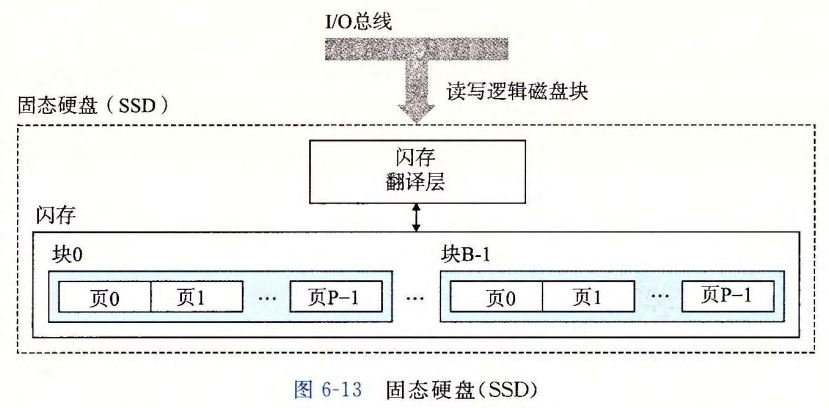

# Memoty Hierarchy

[TOC]

## 存储简介

**总线**（bus）：共享电子线路，在处理器和DRAM主存之间，保证数据传送。

例：

`movq A, %rax`（读事务）

* CPU将A加载进内存总线
* 主存通过内存总线读入A，检索内存得到对应的内存块，将其内容x加载进总线
* CPU从总线读取x，将其复制进寄存器`%rax`

`movq %rax, A`（写事务）

* CPU将地址A加载入总线中，主存将其读入，并等待对应的数据字
* CPU将数据字y加载入总线中
* 主存从总线中读取数据字y，并且存储在地址A中

## RAM：主存的构建模块

重要功能：

* **RAM**通常会封装为芯片

* 基础的存储单元通常是“单元”（cell）。

* 多个RAM芯片组成存储

  | RAM  | 每位晶体管数 | 相对访问时间 | 相对价格 | 应用           |
  | ---- | ------------ | ------------ | -------- | -------------- |
  | SRAM | 6            | 1*           | 100*     | 高速缓存存储器 |
  | DRAM | 1            | 10*          | 1*       | 主存，帧缓冲区 |

  * 刷新：DRAM的电容会漏电，导致数据丢失，需要时刻刷新
  * 稳定性：DRAM稳定，便宜，但是慢；SRAM对光、电噪声等干扰敏感，不稳定，贵，但是快

增强的RAM：

* 同步DRAM（Synchronous DRAM，用与驱动内存控制器相同的外部时钟来代替控制信号，允许重用行地址）
* 双倍数据速率同步RAM（Double Data-Rate Synchronous DRAM，两个时钟沿作为控制信号，按照预取缓冲区的大小划分）

非易失性存储器：

* ROM，PROM（Programmable），EPROM（Eraseable），EEPROM（Electronic）
* 闪存（Flash memory），固态硬盘
* 用途：固件程序（BIOS、硬盘控制器、网卡等），

### 传统的DRAM

DRAM芯片中的单元（位）分为d个超单元（supercell），每个超单元都由w个DRAM单元组成，$d \times w$ 的DRAM总共存储了 $dw$ 位信息。超单元有形如 $(i,j)$ 的地址，$i$ 行 $j$ 列

读取超单元（2，1）：

* 内存控制器发送行地址2（RAS，Row Access Strobe，行访问选通脉冲）
* DRAM将行2的整个内容都复制到一个内部行缓冲区
* 内存控制器发送列地址1（CAS，Column Access Strobe，列访问选通脉冲）
* 超单元（2，1）从缓冲区复制到数据传输线路，返回到CPU

内存模块：

* DRAM芯片封装在内存模块中。图中实例使用8M$\times$8的DRAM芯片，共64M
* 每个超单元储存主存的1个字节，用地址为（i，j）的8个超单元表示主存中地址A处的64位字
* 多个内存模块连接到内存控制器，能聚合成主存

## 存储技术和趋势

### 机械磁盘

构成：盘片、主轴、读/写头，传动臂

* 磁盘表面：磁道、扇区（一个512字节），间隙

* 柱面：所有盘面表面上到主轴中心的距离相等的磁道的集合

* **容量**：记录密度（磁道上1英寸的段中可以放入的位数）、磁道密度（1英寸半径内可以有的磁道数）、面密度（记录密度$\times$磁道密度）
  $$
  磁盘容量=\frac{字节数}{扇区}\times\frac{平均扇区数}{磁道}\times\frac{磁道数}{表面}\times\frac{表面数}{盘面}\times\frac{盘面数}{磁盘}
  $$

* 磁盘、网络等I/O设备容量里$K=10^3,M=10^6,G=10^9$

* 磁盘操作：寻道、读写

* **访问时间**：寻道时间+旋转时间+传送时间

  * 寻道时间 $T_{seek}$ 磁盘参数给出
  * 旋转时间 $T_{avg\ rotation}=\frac{1}{RPM}\times\frac{60s}{1min}\times\frac{1}{2}$
  * 传送时间 $T_{avg\ transfer}=\frac{1}{RPM}\times\frac{1}{平均扇区数/磁道}\times\frac{60s}{1min}$
  * 寻道时间$\times 2$是估计磁盘访问时间简单而合理的方法
  * 磁盘访问时间大约10ms

连接 I/O 设备：**I/O 总线**，链接CPU、主存和IO设备——通用串行总线USB，图形卡（或适配器）、主机总线适配器（SCSI可支持多个磁盘驱动器，SATA只支持一个）

访问磁盘：**内存映射 I/O**技术

* I/O 端口：地址空间中有一块地址是为与 I/O 设备通信而保留。当一个设备连接到总线时，它与一个或多个端口相关联（映射到一个或多个端口）

* **DMA传送**：

  1. CPU通过将命令、逻辑块号和目的内存地址写到与磁盘相关联的内存映射地址，发起一个磁盘读
  2. 磁盘控制器读扇区，并执行到主存的DMA传送，不需要CPU的干涉
  3. DMA传送完成时，磁盘控制器用中断的方式通知CPU

  人话：CPU告诉磁盘要把磁盘内某些内容写到主存里以后，磁盘就会自己去写，传完以后拍一下CPU以告知

### 固态硬盘

固态硬盘（SSD）：

* 读比写要快；随机读和写的性能差别时由底层闪存基本属性决定的

* 基于闪存，由B个块的序列组成，每个块由P页组成

* 页的大小：512B至4KB

* 读取以页为单位，擦除以块为单位；一页所属的块被整个擦除后才能写这个页（擦除指全部设置为1）

* $10^6$ 次重复读写之后块会损坏

* 随机写很慢的原因：擦除块耗时长；修改一个页时要把这个块中所有其他数据全部转移走

  * 闪存翻译层允许记录小的写任务，最小化写的次数

* **平均磨损逻辑**：通过将擦除平均分布在所有的块上，最大化单个块的寿命

* 优点：由半导体存储器构成，没有移动的部件，随机访问时间比旋转磁盘要快，能耗更低也更结实

##  局部性

**局部性原理**：程序无论是存取数据还是存取指令，都趋于聚集在一片连续的区域中，分为时间局部性（Temporal Locality） 和空间局部性 （Spatial Locality） 

1. 时间局部性：**重复引用相同内存位置**
    如果程序中的某条指令一旦执行，不久以后该指令可能再次执行；如果某数据被访问过，不久以后该数据可能再次被访问
  * 程序中存在着大量的循环操作，被引用过一次的存储器位置在未来会被多次引用（通常在循环中）
2. 空间局部性：**连续引用聚集的内存位置**
    一旦程序访问了某个存储单元，在不久之后，其附近的存储单元也将被访问。即程序在一段时间内所访问的地址，可能集中在一定的范围之内
  * 指令通常是顺序存放、顺序执行，数据也一般是以向量、数组、表等形式簇聚存储

有良好局部性的程序比局部性差的程序运行的更快：

* *数组通常有很好的空间局部性，循环通常有很好的时间局部性和空间局部性*
*  重复引用相同变量，时间局部性好
* 步长为k的引用模式，k越小，空间局部性越好，步长为1最好；内存中大步跳来跳去的非常孬
* 取指令：循环体越小，循环迭代次数越多，局部性越好

##  存储器层次结构与高速缓存

高速缓存：下一节
