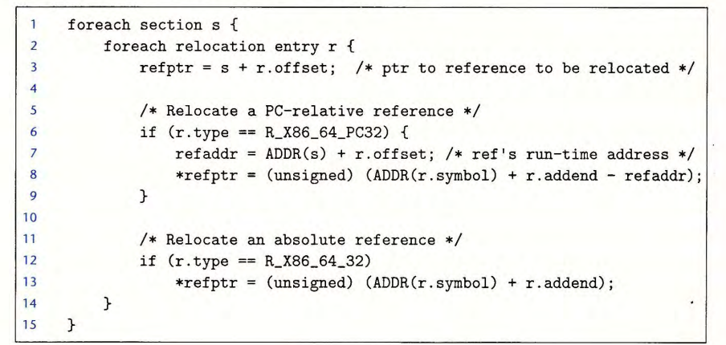
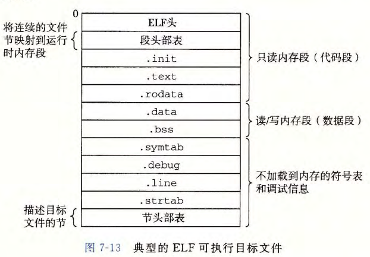
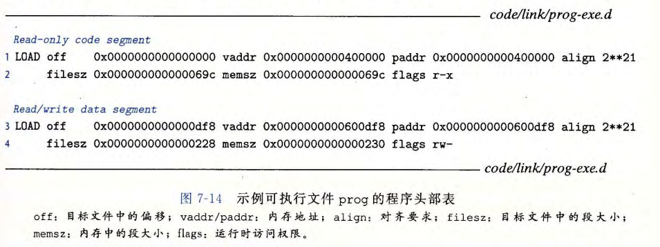
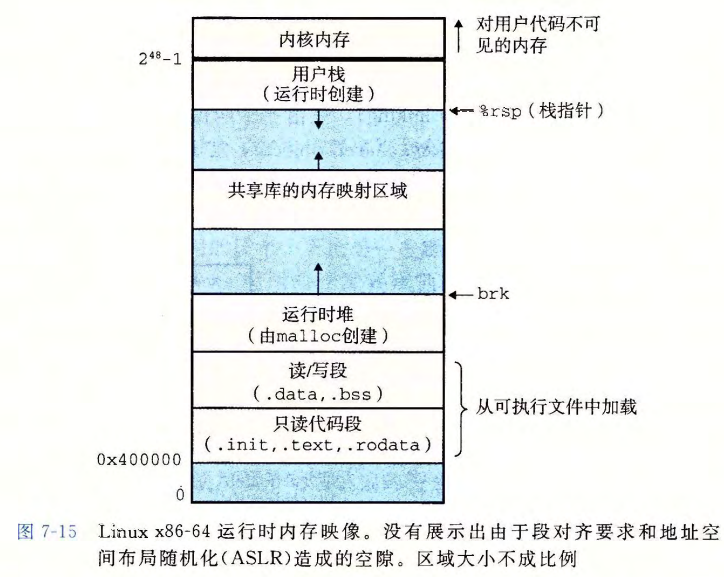

# Linking Basic Concepts & Static Linking


[TOC]


## 综述

链接的好处：模块化、提高效率

* 静态库、共享库


### 编译器驱动程序

gcc：GNU Compiler Collection。

可执行文件的生成：

* 预处理：运行 *C预处理器*（cpp），将C的源程序`main.c`翻译成一个ASCII码的中间文件`main.i`
* 编译：运行 *C编译器*（ccl），将中间文件`main.i`翻译成ASCII汇编语言文件`main.s`
* 汇编：运行 *汇编器*（as），将`main.s`翻译成*可重定位目标文件*`main.o`
* 链接：运行 *链接器程序*（ld），将`main.o`与一些必要的其他文件组合起来

可执行文件的运行：

* *加载器*：将可执行文件的代码和数据复制到内存，将控制转移到程序的开头


## 静态链接

静态链接器：输入可重定位目标文件和命令行参数，输出完全链接的可执行目标文件

链接器的主要任务：

* **符号解析**：`main.o`里定义了*符号*，每个符号对应于一个函数、一个全局变量或一个静态变量

  *符号表*：条目的数组，每个条目包含符号的名称、大小和位置

  符号解析的目的是将每个符号引用正好和一个符号定义关联起来

* **重定位**：将不同文件的代码和数据节合并，将`.o`文件中的符号定义放到到可执行文件中


## 目标文件

1. *可重定位目标文件*`a.o`，包含二进制代码和数据，可以在编译时和其他`.o`文件，创建一个可执行目标文件
2. *可执行目标文件*`a.out`，包含二进制代码和数据，可以被直接复制到内存并执行
3. *共享目标文件*`.so`：可以在加载或运行时被动态地加载进内存并链接

* 编译器、汇编器生成`.o`和`.so`，`ld`生成`.out`
* *目标模块*：字节序列，可以某种方式运行而执行功能
* *目标文件*：以文件形式存储在磁盘中的目标模块
* Windows的目标文件是PE（Portable Executable，可移植可执行）格式，x86-64 Linux和Unix是ELF（Executable and Linkable Format，可执行可链接）格式


## 可重定位目标文件

ELF可重定位目标文件的格式：


* ELF头：生成该文件的字长、字节顺序、ELF头的大小、目标文件的类型、机器类型、节头部表的文件偏移、节头部表中条目的大小和数量

夹在ELF头和节头部表中的都是 **节**：

* `.text`：已编译程序的机器代码

* `.rodata`：只读数据

* `.data`：**已初始化** 的全局和静态C变量

  * 局部C变量在运行时保存在栈中（读取和保存都在`.text`的程序中完成）

* `.bss`：**未初始化 \ 被初始化为0** 的全局和静态C变量

  * **目标文件中不占实际的空间**，仅仅是占位符：

    如声明`int a[114514];`不会让生成的目标文件大小有多大改变，但是`int a[114514] = {-1};`芜湖起飞

    这些变量的初始化交由加载器完成，没必要占用目标文件的空间

* `.symtab`：符号表，存放在程序中定义和引用的函数和全局变量的信息

* `.rel.text`：`.text`节的重定位信息，可执行文件中需要修改地址的指令的相关信息（如：调用外部函数、引用全局变量的指令；调用本地函数的不用修改）

* `.rel.data`：`.data`节的重定位信息，合并成可执行文件时，需要修改的指针类数据（如：已初始化的全局变量的初始值是一个全局变量的地址或外部定义函数的地址）

* `.debug`：程序中定义的局部变量和类型定义、定义和引用的全局变量、原始的C文件：符号调试用（`gcc -g`）

* `.line`：调试用，原始C源程序中的行号和`.text`节中机器指令之间的映射（`gcc -g`）

* `.strtab`，字符串表，包含`.symtab`和`.debug`中的符号表和节头部中的节名字


## 符号和符号表


### 符号

1. **全局符号**：不带`static`属性的C函数和全局变量
2. **局部符号**：带`static`属性的C函数和全局变量
   * 局部符号不是局部变量
3. **外部符号**：在其他模块中定义、被这个模块引用的非静态C函数和全局变量

注：函数（过程）中的`static`变量同样也不是在栈中管理，而是在`.data`或`.bss`中分配空间。

* 若出现同名的`static`变量，则汇编器会让它们有不同的名字，如`x.1, x.2`
* `extern`关键字：强调为外部变量

### 符号表

* 由汇编器构造

* 条目的结构体：

  ```c
  typedef struct {
      Elf64_Word	st_name;       // Symbol name (string table offset), 4 Byte
      unsigned char	st_info;   // Symbol type and bingding
      unsigned char	st_other;  // Symbol visibility
      Elf64_Section	st_shndx;  // Section index
      Elf64_Addr	st_value;      // Symbol value
      Elf64_Xword	st_size;       // Symbol size
  } Elf64_Sym;                   // total size = 24 Byte
  ```

  * `st_name`：字符串表中的字节偏移
  * `st_value`：可重定位：距离定义目标的节的起始位置的偏移；可执行：绝对运行时地址
  * `st_size`：目标的大小
  * `st_info`：数据或函数（4bit），本地或全局（4bit）
  * `st_shndx`：符号被分配到的 **伪节**；伪节：在节头部表中没有条目
    * ABS：不该被重定位的符号
    * UNDEF：未定义的符号
    * COMMON：未被分配位置的未初始化的数据目标
    * 对于COMMON符号，`st_value`给出对其要求，`size`给出最小的大小
    * 伪节只在可重定向目标文件中，可执行中没有
      * COMMON和`.bss`的区别：COMMON为未初始化的全局变量，`.bss`为未初始化的静态变量，和初始化为0的全局、静态变量


## 符号解析

链接器的解析方法：将每个引用与它输入的可重定位目标文件的符号表中的一个确定的符号定义关联起来

当编译器遇到一个不是在当前模块中定义的符号时，会假设该符号是在其他某个模块中定义的，生成一个链接器符号表条目，并把它交给链接器处理

如果链接器在任何输入模块中都找不到这个被引用符号的定义，终止


### 多重定义的全局符号

* 强弱符号：函数和已初始化的全局变量是强符号，未初始化的全局变量是弱符号

规则：

1. 不允许多个同名的强符号
2. 如果有一个强符号和多个弱符号同名，那么选择强符号
3. 如果多个弱符号同名，从这些弱符号中任意选择一个


防止类型错误匹配的规则：

* 能不用全局变量就不用
* 多用`static`
* 在一个头文件中把所有不是`static`的东西都声明了
* 在头文件的声明中全写上`extern`
* 函数无参数的全写`void`


## 重定位

重定位：每个符号定义和一个内存位置关联起来

合并输入模块并为每个符号分配运行时地址

* 重定位节和符号定义：将所有节合并为同一类型的新节，使程序中每条指令和全局变量都有唯一的运行时内存地址
* 重定位节中的符号引用：使用 *重定位条目*，修改代码节和数据节中对每个符号的引用，使它们指向正确的运行时地址

### 重定位条目

汇编器遇到对最终位置未知的目标引用，就会生成一个重定位条目，告诉链接器在生成可执行文件时应该如何修改引用

```c
typedef struct {
    Elf64_Addr r_offset;   /* Address */
    Elf64_XWord r_info;    /* Relocation type and symbol index */
    Elf64_Sxword r_addend; /* Addend */
} Elf64_Rela;
```

* `r_offset`：需要被修改的引用的节偏移
* `r_info`：前64位为如何修改新的引用（`r_type`），后64位标识被修改引用应该指向的符号（`r_symbol`）
* `r_addend`：有符号常数，一些类型的重定位要使用它对被修改引用的值做偏移调整


两种最基本的重定位类型：

* `R_X86_64_PC32`：32位相对地址
* `R_X86_64_32`：32位绝对地址


### 重定位伪代码



* `r`：类型为`Elf64_Rela`的结构体
* `s`：节
* `ADDR(s)`：节的运行时地址；`ADDR(r.symbol)`：符号的运行时地址
* `refptr`：指针指向要修改的符号引用
* `refaddr`：运行时这个引用的地址


### 重定位过程

`objdump -dx`，把代码和重定位条目放在一起

```c
// in main.c
int sum(int *a, int n);
int sum1(int *a, int n);

int array[2] = {1, 2};
int main() {
    int val = sum(array, 2);
    return val;
}


// in sum.c
int sum(int *a, int n) {
    int i, s = 0;
    for (i = 0; i < n; i++) {
        s += a[i];
    }
    return s;
}
```

```assembly
# gcc -Og -c -o main.o main.c
# objdump -dx main.o
0000000000000000 <main>:
   0:   48 83 ec 08             sub    $0x8,%rsp
   4:   be 02 00 00 00          mov    $0x2,%esi
   9:   bf |00 00 00 00|        mov    $0x0,%edi        # 14 <main+0x14>, %edi = &array, 地址放于0xa
                        a: R_X86_64_32       array
  e:   e8 |00 00 00 00|          call   19 <main+0x19>        # 地址放于0xf
                        f: R_X86_64_PC32      sum-0x4
  13:   48 83 c4 08             add    $0x8,%rsp
  17:   c3                      ret
```

* `main`引用了`array`和`sum`，汇编器产生两个重定位条目
* `array`用绝对引用，`sum`用相对引用


#### 重定位PC相对引用

```
r.offset = 0xf
r.symbol = sum
r.type   = R_X86_64_PC32
r.addend = -4
```

内容：修改开始于偏移量`0xf`处的32位PC相对引用，使其确实指向`sum`。假设此时链接器已经确定：

```
ADDR(s) = ADDR(.text) = 0x4004d0：.text节的运行时地址（代码开头）
ADDR(r.symbol) = ADDR(sum) = 0x4004e8：sum的运行时地址
```

计算：

1. `refaddr = ADDR(s) + r.offset = 0x4004df`，得到引用位置的实际地址
2. `*refptr = (unsigned) (ADDR(r.symbol) + r.addend - refaddr) = 0x5`，得到PC相对地址

* 可看出此处的`r.addend`为：*引用地址在代码中的位置，和下一条代码之间的差*——`call`后面的`add`为`0x13`，它之前的第四个字节存着的就是引用地址
* `4004de:    e8 05 00 00 00   callq  4004e8 <sum>`
* 执行这条指令时：CPU先将更新的PC（4004e3）压入栈中，然后`PC=PC+5=4004d8`指向`sum`，就是相对寻址的过程


#### 重定位绝对引用

```
r.offset = 0xa
r.symbol = array
r.type   = R_X86_64_32
r.addend = 0
```

假设此时链接器已经确定：

```
ADDR(r.symbol) = ADDR(array) = 0x601018：array的运行时地址
```

同理，计算：

`*refptr = (unsigned) (ADDR(r.symbol) + r.addend) = 0x601018`

注：其他重定义类型，如`R_X86_64_PLT32`：PC相对，但是指向函数的PLT表


## 可执行目标文件



* **入口点**：`.init`定义的小函数`_init`
* 没有`rel`节：可执行文件已是*完全链接的*，已被重定位
* 可执行文件加载到内存：可执行文件的连续的片被映射到连续的内存段（程序头部表（段头部表）描述了这种映射关系）


程序头部表：



* `off`：可执行目标文件中该段的第一个节的偏移量
* `align`：程序头部表中指定的对齐量

代码段：有读/执行访问权限，开始于内存地址`0x400000`处，总大小`0x69c`字节，被初始化成可执行目标文件的头`0x69c`个字节，包括ELF头、程序头部表和`.init`、`.text`和`.rodata`节

数据段：有读/写访问权限，开始于内存地址`0x600df8`处，总大小`0x230`字节，用从目标文件中偏移`0xdf8`处开始的`.data`节中的`0x228`个字节初始化，剩下的8个字节对应运行时将被初始化为0的`.bss`数据

* 对于任何段s，链接器必须选择一个起始地址`vaddr`，使得

  `vaddr mod align = off mod align`

  用途：优化，使得程序执行时，目标文件中的段能很有效率地传送到内存中


## 加载可执行目标文件

* Linux程序可通过调用`execve`函数来调用加载器
* **加载**：将程序复制到内存并执行的过程
* 代码段和数据段之间有间隙：`.data`的对齐要求
* 入口点：`.start`函数
* ASLR：区域的相对位置不变


