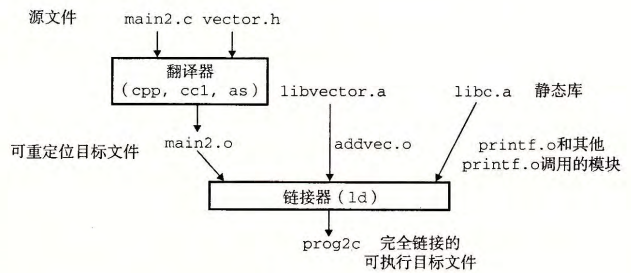
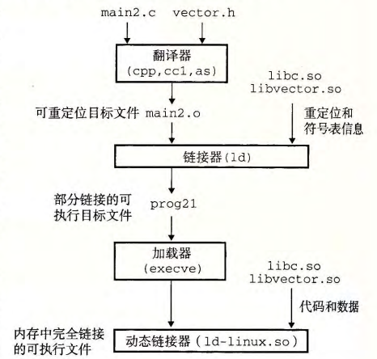
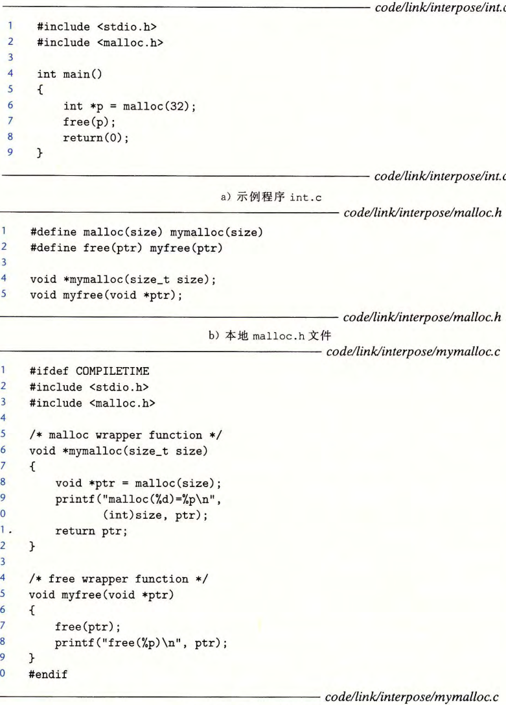
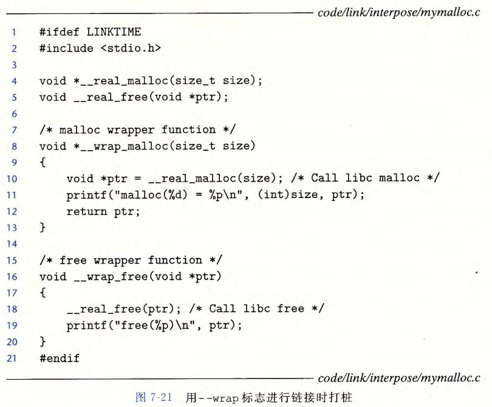
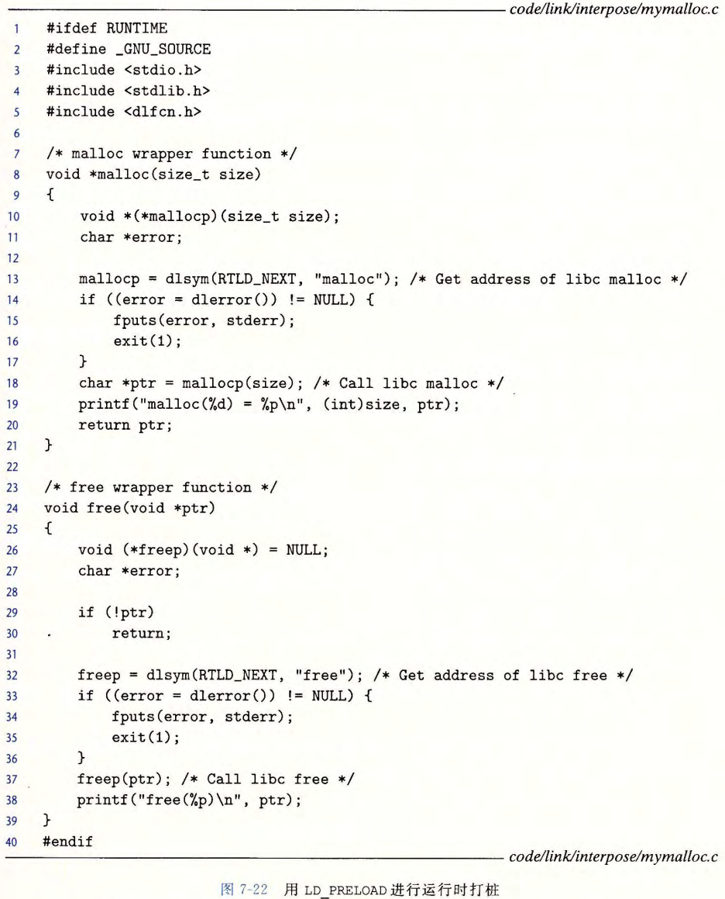

# Shared Libraries & Dynamic Linking


## 库

为什么要有库？

处理公共函数：

* 把多个同类的（所有的）公共函数放入一个文件中？
  * 用起来简单，但每次用的时候，程序中都会包含这堆函数的一个副本，废空间废时间
* 为每个标准函数创建一个独立的可重定位文件？
  * 要求应用程序员显式地一个一个链接，烦
* 让C编译器自动识别这些函数？
  * C的标准函数太多了，且每次改标准函数的时候都要更新一遍编译器


## 静态库

* 把相关的函数编译为独立的目标模块，按顺序封装到一起
* 使用的时候以库为单位写在命令行里（`gcc`总会将`libc.a`传送给链接器）
* 实际链接时，链接器只复制被程序用到的模块
* 存储方式：*存档*（archive）`.a`，文件头会存储每个成员文件的大小和位置


### 创建静态库

`ar`工具



### 常用的库

* libc.a：c std库，标准I/O，内存分配，整数数学，字符串操作等
* libm.a：数学
* `ar -t /usr/lib/x86_64-linux-gnu/libm-2.35.a | sort`


### 解析引用

* 三个集合
  * E：最终合成可执行文件的`.o`们
  * U：还未解析的符号
  * D：解析了的符号
* 输入`.o`：把它添加到E中，修改U和D
* 输入`.a`：逐个匹配U中符号和`.a`文件的成员中定义的符号，如果匹配成功就将其添加到E，并修改U和D
* 最终U为空则正常输出，否则报错：undefined reference to xxx


## 动态链接、加载和执行

### 共享库

静态库的缺点：

* 函数代码被复制进文本段中，每个进程都复制一遍，浪费空间；
* 静态库每次更新，调用它的程序都要重新编译一次


共享库：**加载** 或 **运行** 时才链接到应用中，也叫 **动态链接库**，DLL，`.so`

* 加载时链接：由动态链接器链接
* 可同时被多个进程共享


**构建共享库**



```sh
gcc -Og -c -fpic
gcc -shared
```


### 加载时链接

**动态链接的可执行文件**

引用共享库时，需要的内容：

* `.interp`节，包含要使用的动态链接器（如`ld-linux.so`）的路径名
  * 动态链接器本身就是一个共享库
  * `readelf -p .interp prog`
* `.dynamic`节，指定要使用的动态库的名称等
  * `readelf -d prog`查看这一节的内容
  * `ldd prog`查看库的地址


**加载时的链接过程**

* 创建可执行文件时静态执行一些链接，文件中只有重定位和符号表信息，程序加载时将其解析
* 加载器加载和运行时，不把控制传递给应用（因为有`.interp`节），而是运行动态链接器
* 链接器会对程序的外部引用进行重定位，告诉程序它引用的外部变量/函数的地址，地址位于共享库被加载在内存的区间内
* 此时共享库位置固定


#### 位置无关代码

如何实现“共享”？

* 给共享库预留专用的地址空间？不使用时还要给它留着，使用效率低，难管理
* 共享库能加载到内存任意位置，无需链接器修改
* 这样的话编译器是找不到代码位置的

位置无关代码：PIC（Position-Independent Code）：使共享的代码段加载到内存的任何位置而无需链接器修改

* 可以加载而无需重定位，`-fpic`


还有什么问题？

* 数据段能更改，代码段不能
* 将地址存在数据段里，代码段访问数据段中指向的变量、函数
* 一个程序中的数据段和代码段相对位置是不变的
* PC相对的寻址模式

**GOT表**：Global Offset Table，全局偏移量表，就是数据段中存储地址的结构

* 位于数据段开始的地方
* 数据：数据的地址可以在加载时直接放进表中
* 函数：函数的地址可以在加载时直接放进表中，但是……？


延迟绑定：将地址的绑定推迟到第一次调用过程时

怎么实现？

已知：

1. `ld-linux.so`可以通过传入参数，改掉数据段里的数据
2. 一开始GOT里指向的是链接操作，操作完以后下一次指向的就是具体函数地址


**PLT表**：Procedure Linkage Table，过程链接表，每个条目16字节

* PLT[0]：调转到动态链接器
* PLT[1]：系统启动函数`__libc_start_main`
* PLT[2]开始：调用的函数

一起使用的GOT表：

* GOT[0]：`.dynamic`的地址
* GOT[1]：重定位条目的地址
* GOT[2]：动态链接器的地址
* GOT[3]：系统启动函数
* GOT[4]开始：调用的函数


**ld-linux.so**

* 既是一个共享库，也是一个可执行文件
* 由glibc构建


其他的内容：共享库中的数据也是共享的吗？


### 运行时链接

用途：

* 分发软件：修改库后，不用重新编译应用
* 构建高性能服务器：来自Web浏览器的请求到来时，服务器才加载、链接函数
* 库打桩

相关接口：

* `dlopen`：加载和链接共享库
* `dlsym`：返回符号的地址
* `dlclose`：卸载共享库
* `dlerror`：调用上面三个函数时发生的最近的错误


## 实例：库打桩

截获对共享库函数的调用，取而代之执行自己的代码

追踪对某个特殊库函数的调用次数、验证和追踪它的输入和输出值



### 编译时打桩

让预处理器用相应包装函数的调用替换掉对目标函数的调用（`#define main mian`）

使用

```sh
gcc -DCOMPILETIME -c mymalloc.c
gcc -I. -o intc int.c mymalloc.o
```

`-I`：让C预处理器在搜索通常的系统目录之前，先在当前目录查找


### 连接时打桩

`--warp f`：将对符号`f`的引用解析成`__weap_f`，对符号`__real_f`的引用解析成`f`



```sh
gcc -DLINKTIME -c mymalloc.c
gcc -c int.c
gcc -W1,--wrap,malloc -W1,--wrap,free -o int1 int.o mymalloc.o
```

`-W1,option`：将`option`内所有逗号变为空格后将其传递给链接器


### 运行时打桩



````sh
gcc -DRUNTIME -shared -fipc -o mymalloc.so mymalloc.c -ldl
gcc -o intr int.c
````

运行：

```sh
LD_PRELOAD="./mymalloc.so" ./intr
```


总结：
* 静态：
  * 运行时不需要去查找库
  * 不需要额外的PLT间接寻址
  * 每个程序进程都要复制一份
  * 链接：编译、链接
* 动态：
  * 占用空间更少
  * 共享库置于内存中
  * 寻址和查找带来额外的时间开销
  * 链接：加载、运行


## 附：二进制工具


