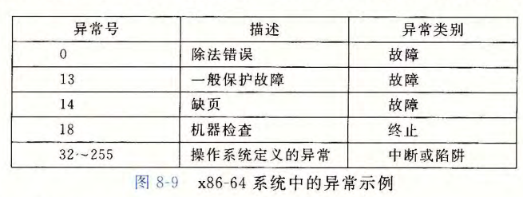

# Exceptions and Processed

[TOC]


## ECF

* 控制转移：程序计数器从某个值（指令地址）到另一个值的过渡

* 控制流：CPU只是读并执行一系列指令，这个指令序列就是CPU的控制流

* 异常控制流：Exceptional Control Flow，通过使控制流发生突变，使系统对系统状态的变化作出反应

  如：数据从磁盘或网络处接收，除以0，按下Ctrl+C


## 异常

事件：处理器中的状态变化

**异常**：控制流中的突变，用来响应处理器状态中的某些变化


异常表：跳转表，跳转到相应的异常处理程序。处理完后可能：返回当前指令、返回下一条指令，或终止被中断的程序


### 异常处理

**异常号**：异常的ID，非负整数，假设某异常的异常号为 $k$

* 异常号由处理器设计者分配，或由操作系统内核设计者分配

**异常表**：跳转表，表目 $k$ 为异常 $k$ 的处理程序的地址

* 异常处理时间接调用，转到对应的异常处理程序（内核中）
* *异常表基址寄存器*：存放异常表的起始地址

异常处理和过程调用的区别

* 异常处理返回地址选择更多（当前指令、下一指令、终止）
* 为了还原程序状态，会将更多参数压入栈（包含条件码的EFLAGS）
* 如果控制从程序转移到内核，项目都压到内核栈中，而不是用户栈
* 异常处理程序运行在内核模式下，它们对所有系统资源都有完全的访问权限


### 异常的类别

* 中断：异步，来自处理器外部的I/O设备的信号，返回到下一条指令
* 陷阱：同步，有意的异常，返回到下一条指令
* 故障：同步，潜在可恢复的错误，可能返回到当前指令
* 终止：同步，不可恢复，不会返回

**中断**：

* 当前指令执行完后，控制传递给处理程序，处理程序返回到下一条指令
* 程序继续执行，仿佛没有中断过
* 最常见的：时钟，发给内核，开启上下文切换

**陷阱**：

* 有意的异常，用途为在用户程序和内核之间提供一个像过程一样的接口：**系统调用**
  * 向内核请求服务：`read`，`fork`，`execve`，`exit`等，用`syscall`指令请求相关服务
* 来到`syscall`指令，控制传递给处理程序，陷阱处理程序运行，处理程序返回到`syscall`之后的指令
* 看起来和普通函数一样，但是运行在内核模式中

**故障**：

* 当前指令导致一个故障，控制传递给处理程序，故障处理程序运行
* 若能修正错误情况，将控制返回到引起故障的指令，重新执行它
* 若不能，返回到内核中的`abort`例程，终止引起故障的应用程序
* 典型的故障，如*缺页异常*：指令引用的虚拟地址对应的物理页面不在内存中，缺页控制程序从磁盘中加载适当的页面，再将控制返回引起故障的指令，指令能正常运行

**终止**

* 不可恢复的致命错误，通常是硬件错误，如读写非法内存
* 终止处理程序直接将控制返回给`abort`


### Linux/x86-64系统中的异常



故障和终止：

* 除法错误：不会试图恢复，终止程序
* 一般保护故障：程序引用了未定义的虚拟内存区域，或试图写一个只读的文本段，Segmentation fault
* 机器检查：导致故障的指令执行中检测到致命的硬件错误，不把控制返回给应用程序

系统调用：


例：系统级函数的hello world：

```c
int main()
{
    write(1, "hello, world\n", 13); // 第一个参数1将输出发送到stdout,第三个参数是要写的字节数
    _exit(0);
}
```

汇编：

```assembly
main:
    movq $1,%rax                  # write的编号,存在%rax里
    movq $1,%rdi                  # 参数1
    movq $string,%rsi             # 参数2,指向字符串
    movq $len,%rdx                # 参数3,len为字符串长度
    syscall                       # write
    movq $60,%rax                 # _exit的编号
    movq $0,%rdi                  # 参数1
    syscall                       # _exit
```

参数和正常函数一样，`%rax`中存储系统调用的编号，返回值在`%rax`中


## 进程

**进程**：执行中程序的实例，系统中每个程序都运行在某个进程的*上下文*中。

抽象：

* 一个独立的逻辑控制流
* 一个私有的地址空间


**逻辑控制流**


* 每一个过程都有一个单独的逻辑控制流
* **并发流**：两个流在时间上重叠；X和Y互相并发，当且仅当X在Y开始之后和Y结束之前开始，或者Y在X开始之后和X结束之前开始
  * 上图AB、AC互相并发，BC没有：C在B结束后开始
* *并发*：多个流并发地执行
* 在不同的处理器核或计算机上：*并行*，*并行流*
* *多任务*：并发和并行


用户模式：没有设置模式位，不允许执行 **特权指令**（停止处理器、改变模式位、发起I/O操作）

* 中断、陷入异常可以变为内核模式，返回到应用程序代码时又改回用户模式

**上下文切换**：调度器保存当前进程的上下文，恢复被之前抢占的进程被保存的上下文，将控制传递给新恢复的进程

* *调度*：在进程执行的某些时刻，内存可以决定抢占当前进程，并重新开始一个先前被抢占的进程
  * 抢占式调度：内核强制暂停某个进程，例如发现其他进程的I/O完成
  * 非抢占式调度：内核让出进程，如`pause()`
* 也是一种ECF，调度器在内核中


## 进程控制

### 系统调用错误处理

Unix系统及函数遇到错误时，通常会返回-1并设置全局整数变量`errno`

`strerror`返回文本串，描述和`errno`值相关联的错误。

```c
void unix_error(char *msg)
{
    fprintf(stderr, "%s: %s\n", msg, strerror(errno));
    exit(0);
}
```

错误处理包装函数例：

```c
pid_t Fork(void)
{
    pid_t pid;
    if((pid = fork()) < 0)
        unix_error("Fork error");
    return pid;
}
```


### 获取进程ID

`pid`：正数进程ID

```c
#include <sys/types.h>
#include <unistd.h>

pid_t getpid(void); // 返回当前进程的pid
pid_t getppid(void); // 返回父进程的pid
```


### 创建和终止进程

进程总是处于运行、停止或终止

* *运行*：在CPU上执行，或者等待被执行且最终会被内核调度
* *停止*：进程被*挂起*，且不会被调度
  * 收到SIGSTOP、SIGTSTP、SIGTTIN或者SIGTTOU信号时停止
  * 停止的进程收到SIGCONT时再次开始运行
* *终止*：进程永远停止：
  1. 收到一个内容为终止进程的信号
  2. 从主程序返回
  3. 调用`exit`函数


**创建子进程**

父进程：通过调用`fork`函数创建一个新的运行的子进程，在父进程中返回子进程`pid`，子进程中返回0

* 调用一次，返回两次

* 并发执行：父进程和子进程是并发执行的独立进程（无法预测执行顺序）

  ```c
  int main() {
    int x = 1;
    pid_t pid;
    pid = Fork();
    if (pid == 0) {
      for (int i = 0; i < 1919180; i++);
      printf("child: x=%d\n", ++x);
      return 0;
    }
    for (int i = 0; i < 1919180; i++);
    printf("parent: x=%d\n", --x);
    return 0;
  }
  ```

  

* 子进程的虚拟地址空间和父进程相同，但是是独立的

* 子进程获得与父进程任何打开文件描述符相同的副本（如输出同时显示在屏幕上：`stdout`）

* 进程图：拓扑排序

**终止**：`void exit(int status)`：以`status`退出状态来终止进程

* 正常是0，其他是不正常
* `exit`调用了一次，永不返回


### 回收子进程

进程终止时，子进程应该被父进程*回收*（reaped）

* 如果父进程没有回收而终止了，那么内核安排`init`进程来回收子进程。
* 如果父进程终止了且子进程没结束，`init`进程会成为孤儿进程的养父
* 终止但未被回收的进程为*僵死进程*，僵死进程仍然消耗系统内存资源


`waitpid`函数

* `pid_t waitpid(pid_t pid, int *statusp, int options)`
* 功能：挂起调用进程的执行，直到它的**等待集合**中的一个子进程终止，终止后对其进行回收。如果等待集合中的一个进程在刚调用的时候就终止了，那么就立即返回并回收它
* 返回：回收的那个子进程的PID


参数`pid`：*判定等待集合的成员*

* `pid > 0`，PID为`pid`的子进程
* `pid = -1`，父进程的所有子进程

参数`option`：*修改默认行为*

* 默认为0：等到有进程终止，回收它并返回
* WNOHANG：如果等待集合中任何进程都没有终止，那就立即返回，返回值为0
* WUNTRACED：等到有进程终止或停止时，返回：
* WCONTINUED：等到有进程终止，或有停止的进程收到SIGCONT信号并重新开始执行时，返回
* 用`|`运算组合

参数`statusp`：检查已回收子进程的退出状态

* 若非空，则函数会在这里放入导致返回的子进程的状态信息
* 检查`status`：
  * `WIFEXITED(status)`：正常终止：如果子进程通过调用`exit`或者`return`正常终止，返回`true`
  * `WEXITSTATUS(status)`：返回正常终止的子进程的退出状态
  * `WIFSIGNALED(status)`：信号终止：子进程因为一个未捕获的信号而终止，返回`true`
  * `WTERMISG(status)`：返回导致子进程终止的信号的编号
  * `WIFSTOPPED(status)`：返回的子进程当前是停止的，返回`true`
  * `WSTOPSIG(status)`：返回引起子进程停止的信号的编号
  * `WIFCONTINUED(status)`：如果子进程收到SIGCONT重新启动，返回`true`

错误条件：

* 调用进程没有子进程，`waitpid`返回-1，`errno = ECHILD`
* `waitpid`被一个信号中断，返回-1，`errno = EINTR`


`wait`函数：`wait(int *statusp)`

* `wait(&status)`等价于`waitpid(-1, status, 0)`

其他：

* 系统不会按照特定顺序来回收子进程，回收子进程的顺序时特定计算机系统的属性。


### 让进程休眠

`unsigned int sleep(unsigned int secs)`：休眠`secs`秒

* 如果请求的时间到了，返回0；否则返回剩下要休眠的秒数（可能被信号中断而过早返回）

`int pause(void)`：休眠，直到进程接收到一个信号


### 加载并运行程序

`execve`

* `int execve(const char *filename, const char *argv[], const char *envp[])`

* 加载并运行目标文件`filename`，带参数列表`argv`和环境变量列表`envp`

* `argv`为参数列表，`argv[0]`是可执行目标变量的名字

* `envp`为环境变量列表，环境变量字符串形如`name=value`的名字 - 值对

* 出错时返回，否则不返回（调用启动代码，启动代码设置栈并将控制交给新函数的主函数`int main(int argc, char *argv[], char *envp[])`

* 操作环境数组：

  * `char *getenv(const char *name)`：返回：若存在“name=value”则指向name的指针，无匹配则返回NULL
  * `void *unsetenv(const char *name)`：删除字符串“name=value”
  * `int setenv(const char *name, const char *newvalue, int overwrite)`：`name`存在则设置新的环境变量，`name`不存在则加入“name=newvalue”

  


