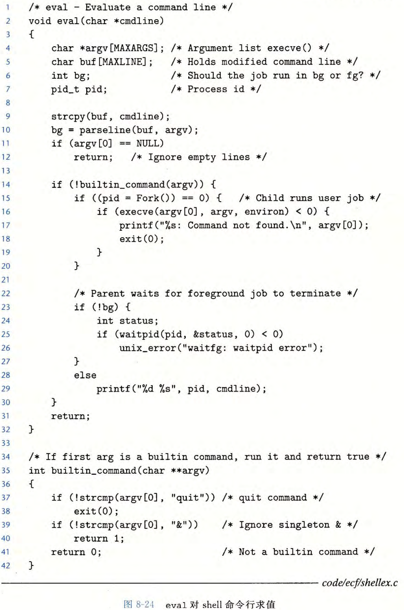

# ECF Signals and Nonlocal Jumps


[TOC]

## Shell

Shell：交互型的应用级程序，执行一系列的 **读/求值** 步骤，然后终止。

* 读：读取来自用户的一个命令行
* 求值：解析命令行，代表用户运行程序
* 通过判断命令结尾是否有`&`，让`shell `在后台或前台执行程序


`parseline`解析以空格分割的命令行参数，将分割后的值丢入`argv`中，末尾为`&`则返回1，后台运行

`eval`函数的简单实现：



* 无限循环，不应该积累：内存、子进程、文件描述符
* 回收后台子进程：*信号*


## 信号

**信号**：小消息，通知进程系统中发生了某种类型的事件，允许内核中断其他进程

* 类似于异常和终端，由内核发送到进程，由信号ID指明类型

  

* 例如：除以0——SIGILL；非法内存——SIGSEGV；Ctrl+C——SIGINT；强制终止——SIGKILL；子进程终止或停止时，内核发送SIGCHLD给父进程；


术语：

**发送信号**：内核检测到一个系统事件，或进程调用了`kill`函数，显式地要求内核发送一个信号给目的进程；进程可以发送信号给自己

**接收信号**：目的进程被内核强迫以某种方式对信号的发送作出反应。进程可以忽略这个信号，终止或通过执行 **信号处理程序** 捕获信号

**待处理信号**：发出但没有被接收的信号

* 任何时刻，一种类型至多只会有一个待处理信号，多的同种信号被简单丢弃
* 进程可以有选择地 **阻塞** 接收某种信号，这种待处理信号不会被接收，直到进程取消对这种信号的阻塞
  * 一个待处理信号最多被接收一次，内存为每个进程在`pending`位向量维护着待处理信号的集合，而在`blocked`位向量维护着被阻塞的信号集合。只要传送一个类型为`k`的信号，内核就会设置`pending`中的第`k`位，而只要接收了一个类型为`k`的信号，内核就会清除`pending`中的第`k`位。


### 发送信号

1. **进程组**
   * 子进程和它的父进程同属于一个进程组，进程组ID为正整数，`getpgrp`获取
   * `setgpid(pid_t pid, pid_t pgid)`将进程`pid`的进程组改为`gpid`，`pid = 0`时改变当前进程，`gpid = 0`时用`pid`指定的进程ID作为进程组ID

2. `/bin/kill`程序发送信号

   如：`/bin/kill -9 11451`将发送信号`9`（SIGKILL）给进程11451

   * PID为负则指定进程组的PID，`/bin/kill -9 -11451`将信号`9`发给进程组`11451`中的所有进程

3. 从键盘发送信号

   * 发送给前台进程组中的每个进程

   * Ctrl+C（SIGINT），终止前台作业

   * Ctrl+Z（SIGTSTP），挂起前台作业

   * **作业**：对一条命令行求值而创建的进程，任何时刻前台作业至多一个，后台作业任意

4. `kill`函数发送信号

   `int kill(pid_t pid, int sig)`

   * `pid > 0`指定进程，`pid = 0`调用进程及同组所有进程，`pid < 0`绝对值指向的进程组

5. `alarm`函数发送信号：`unsigned int alarm(unsigned int secs)`，`secs`秒后发给自己

   * `secs = 0`，不会调度，也不会发送信号
   * 会取消待处理的`alarm`，返回值为被取消的`alarm`还有多少秒，其他返回0


### 接收信号

当内核把进程`p`从内核模式切换到用户模式时（上下文切换或系统调用返回），它会检查进程`p`的 *未被阻塞的待处理信号的集合*。

* 某些情况下，系统调用也可以被信号打断（课外内容，无视就好）

```c
pnb = pending & ~blocked; // 未被阻塞的待处理信号
if (pnb == 0)
    // 控制流交回I_next
else
    // 选择pnb中某个信号k（通常是最小的k）并强制p接收k
    // 处理信号
    // 若pnb中还有信号未处理，重复接收并处理之
    // 控制流交回I_next
```

- 每个信号类型都有一个预定义的默认类型，以下几种.
  - 终止
  - 终止并转储存器
  - 停止直到被SIGCONT重启
  - 忽略信号
- 进程可以通过使用`signal`函数修改和信号相关联的默认行为，除了SIGSTOP和SIGKILL

**`signal`函数**

* `sighandler_t signal(int signum, sighandler_t handler)`

* 返回：成功则为指向 $I_{next}$ 的指针，失败则为SIG_ERR（不设置`errno`）

* 若`handler`为SIG_IGN，则忽略类型为`signum`的信号；若为SIG_DEL，则类型为`signum`的信号恢复为默认行为

* 否则为自定义的信号处理函数：

  * 只要进程接收到一个类型为`signum`的信号，就会调用`handler`
  * 设置信号处理程序：改变默认处理行为
  * 调用信号处理程序：捕获信号
  * 执行信号处理程序：处理信号

* 处理程序返回后，控制一般会交回 $I_{next}$（某些系统中，被中断的系统调用会立即返回一个错误）

* 信号处理函数可以被其他信号处理程序中断：

  

信号处理程序和并发流：信号处理程序的逻辑控制流（在返回前）与主函数的逻辑控制流重叠


### 阻塞和解除阻塞信号

**隐式阻塞机制**

* 内核通常会**阻塞**当前处理程序 *正在处理* 的类型的 *待处理信号*
* 例如：SIGINT的信号处理函数不会被另一个SIGINT中断
  * 存在一个待处理的信号`k`，仅仅表明至少一个一个信号`k`到达过，而不是有几个`k`

**显式阻塞机制**：`sigprocmask`


`sigprocmask`函数改变当前阻塞的信号集合

* `how`：

  SIG_BLOCK：`blocked = blocked | set`

  SIG_UNBLOCK：`block = blocked & ~set`

  SIG_SETMASK：`block = set`

  如果`oldset`非空，`blocked`位向量之前的值保存在`oldset`中
  
* `sigaddset`：将`signum`添加到`set`

* `sigfillset`：将每个信号都添加到`set`

* `sigdelset`：从`set`中删除`signum`


### 编写信号处理程序

信号处理程序和主程序以及其他信号处理程序并发的运行。如果处理程序和主程序访问同样的全局数据结构，就会产生不可预知的结果

1. **安全的信号处理**

   * 处理程序要尽可能简单

     * 可能只是简单地设置全局标志并立即返回，所有与接收信号相关的处理都由主程序执行，主程序周期性检查并重置这个标志

   * 在处理程序中只调用异步信号安全的函数

     * 可重入（只访问局部变量），或不能被信号处理程序中断

       

       唯一安全输出：`write`

       也可使用`sio`系（csapp帮你写好的）
       
     * **线程安全**：多个线程并发同一段代码时，不会出现不同的结果

       * 线程不安全：修改全局变量、函数状态调用时会发生变化、调用了其他线程不安全

     * **可重入**：多个执行流反复执行一个代码，其结果不会发生改变；是线程安全的一种

   * 保存和恢复`errno`：许多Linux异步信号安全的函数都会在出错返回时设置`errno`，在处理程序中调用这样的函数可能会干扰主程序中其他依赖于`errno`的部分

   * 阻塞所有信号，保护对共享全局数据结构的访问

   * 用`volatile`声明全局变量（不通过寄存器缓冲，直接缓存）

   * 用`sig_atomic_t flag`声明标志：对该变量的读和写保证是不可中断的

2. **正确的信号处理**

   * 信号不能用于计数，多次重复发来的信号只接收一个
   * 每次处理时，应尽可能多地判断是否将所有的事情都处理完毕

3. **可移植的信号处理**

   * `signal`的语义不相同（一些老Unix的`signal`是一次性的）

   * 系统调用可以被中断（一些较早版本Unix的`read`，`write`，`accept`被中断不会重启而是返回错误）

   * Posix标准定义了应用并不广泛的`sigaction`函数

     * 一个更简洁的方式Signal

     * 调用方式和signal一样

     * 只有当前类型信号被阻塞，不排队，自动重启，信号处理设置永久化

       

### 同步流以避免讨厌的并发错误

父进程创建子进程时将其加入作业列表

子进程僵死时删除出去

子进程会继承父进程的`mask`，`execve`前需要`unblock`


### 显式地等待信号

* 有时候主程序需要显式地等待某个信号处理程序运行

  例如，当Linux shell创建一个前台作业时，在接收下一条用户命令之前，它必须等待作业终止 ，被SIGCHLD处理程序回收

  循环等待：浪费处理器资源

  * `pause`：有竞争

  * `sleep`：慢

  * `sigsuspend`：好

* 将mask暂时替换为当前阻塞集合，然后挂起。收到信号时，要么直接终止（不返回）；要么运行处理程序，返回时恢复`mask`


## 非本地跳转

C语言提供的用户级异常控制流形式，**不进入内核**

* 直接将控制从一个函数转移到另一个当前正在执行的函数，不需要经过正常的调用 - 返回

* ```c
  int setjump(jmp_buf env);
  int sigsetjmp(sigjmp_buf env, int savesigs);
  // setjmp返回0，longjmp返回非零
  ```
  
  `setjump()`在`env`缓冲区中保存当前调用环境，以供后面的`longjump`使用，返回0
  
  * 返回值不能赋值给变量，但可以用在`switch`或条件语句测试中
  
* ```c
  void longjmp(jmp_buf env, int retval);
  void siglongjmp(sigjmp_buf env, int retval);
  // 从不返回
  ```
  
  `longjmp()`从`env`缓冲区恢复调用环境，然后触发一个从最近一次初始化`env`的`setjmp`调用的返回。然后`setjmp`返回，并带有非零的返回值`retval`

注：

* `sig`前缀是被信号处理程序使用的版本
* `setjmp`只调用一次，但返回多次：第一次调用`setjmp`时返回一次（0），之后`longjmp`调用时每次都会返回（`retval`）
* `longjmp`自身永不返回
* 应用：从深层嵌套的函数中立即返回，通常因为检测到某个错误（`try-catch`）
* 可能产生内存泄漏（跳过释放内存的代码）

例：输入Ctrl+C时实现软重启


* 先调用`sigsetjmp`再设置处理程序，否则会冒险（`siglongjmp`可能在`sigsetjmp`设置前先执行：假设程序运行到设置处理程序后立即受到信号）
* `sigsetjmp`和`siglongjmp`不是异步信号安全函数，因为一般他们可以跳到任意代码
* 注意在`siglongjmp`可达代码中只调用安全函数


## 操作进程的工具

* STRACE：打印一个正在运行的程序和它的子进程调用的每个系统调用的轨迹
* PS：当前系统中的进程（包括僵死进程）
* TOP：当前进程资源使用的信息
* PMAP：现实进程的内存映射
* `/proc`：一个虚拟文件系统，以ASCII文本格式输出大量内核数据结构的内容，用户程序可以读取这些内容。比如，`cat/proc/loadavg`可看到Linux系统上当前的平均负载
