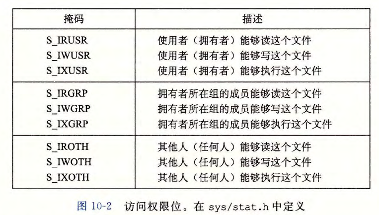
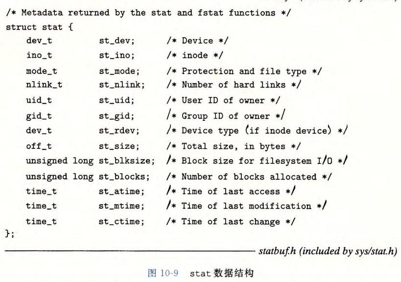
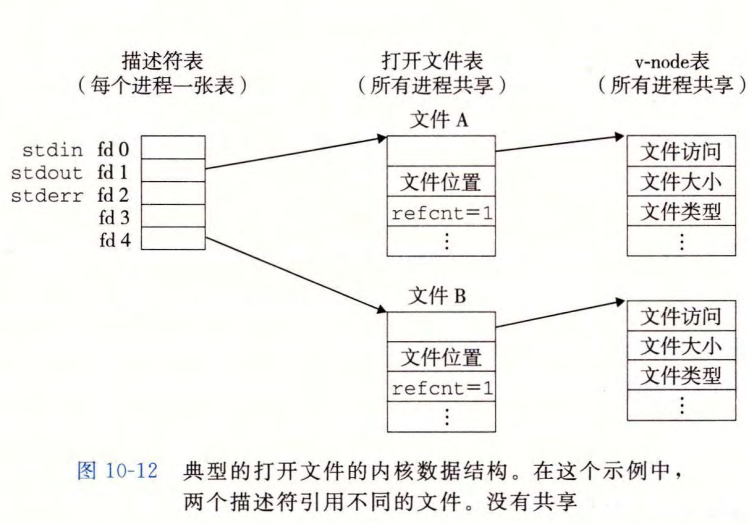
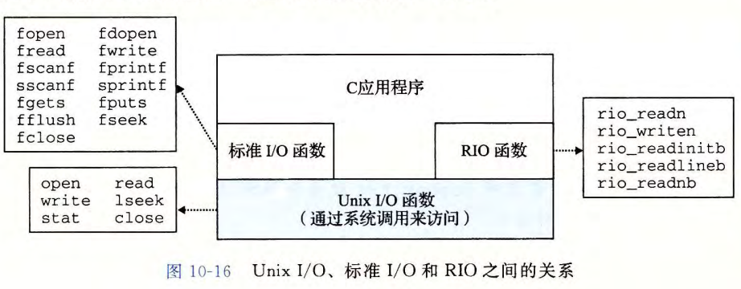

# System-Level I/O

[TOC]


## Unix I/O

**Linux文件**：一个m字节的序列：
$$
B_0, B_1, \dots, B_k, \dots,B_{m-1}
$$

* 所有的I/O设备都表现成文件形式
* 内核也表现得像个文件：`/boot/vmlinuz-3.13.0-55-generic`

统一输入和输出的方式：

* 打开文件：**描述符**：小的非负整数，在后续对此文件的所有操作中标识这个文件，内核记录有关这个打开文件的所有信息，应用程序只需要记住描述符
* 改变当前文件位置


## 文件

文件类型：

* *普通文件*：包含数据，文本文件/二进制文件
* *目录*（directory）：包含一组链接，每个连接都将一个文件名映射到一个文件
  * “`.`”自己，“`..`”父目录
  * `ls`扫内容
* *套接字*（socket）：跨网络通信
* 命名通道、符号链接、字符和块设备等

目录层次结构：Linux内核将所有文件都组合成一个目录层次结构

* 不是树结构，可以软链接 / 硬链接
* **当前工作目录**：`cd`、相对路径
  * 绝对路径：以`/`（根目录）开始
  * 相对路径：`./`


## 打开和关闭文件

**打开文件**：`open`函数

* `int open(char *filename, int flags, mode_t mode)`

* 返回：成功则为新文件标识符，出错为-1

* `flag`：O_RDONLY只读，O_WRONLY只写，O_RDWR可读可写，

  O_CREAT文件不存在就创建截断的空文件

  O_TRUNC文件存在，则截断（清空）

  O_APPEND写操作前，将文件位置设置为文件的结尾处

* `mode`：新文件的访问权限位

  

**关闭文件**：`close`函数

* `int close(int fd)`
* 关闭一个已关闭的标识符会报错


## 读和写文件

`read`、`write`

* ```c
  ssize_t read(int fd, void *buf, size_t n);
  // 返回：成功则为读的字节数，EOF则为0，出错为-1
  ssize_t write(int fd, const void *buf, size_t n);
  // 返回：成功则为写的字节数，出错为-1
  ```

* `read`：从`fd`的当前文件位置复制最多n个字符到内存位置

* `write`：从内存位置`buf`复制至多n个字节到描述符`fd`的当前文件位置

* `lseek`：显式地修改当前文件的位置

  * `ssize_t`：`long`；`size_t`：`unsigned long`


Short Counts：**不足值**：`read`和`write`传送的字节必应用程序要求的要少

* 出现：遇到EOF、从终端读文本行、从网络套接字读写
* 写磁盘时一定不会，读磁盘时只要没遇到EOF那也不会


## RIO

这书作者自己写的一个包，Robust I/O，健壮的I/O包，自动处理不足值，包含 **有缓冲** 和 **无缓冲**

* 缓冲区：读入时一次性多读入一些，将需要多次分开的`write`和`read`进行合批

无缓冲：

* ```c
  ssize_t rio_readn(int fd, void usrbuf, size_t n);
  ssize_t rio_writen(int fd, void usrbuf, size_t n);
  ```

* 成功则返回传送的字节数（总数-不足值），EOF则为0（`rio_readn`），出错为-1

* 被信号处理程序的返回中断时，会自动重新调用


带缓冲：

* ```c
  void rio_readinitb(rio_t *rp, int fd);
  ssize_t rio_readlineb(rio_t *rp, void *userbuf, size_t maxlen);
  ssize_t rio_readnb(rio_t *rp, void *usebuf, size_t n);
  ```

* 成功则返回读的字节数，EOF为0，出错为-1

* `rio_readlineb`：从内部读缓冲区复制一个文本行；缓冲区为空时，调用`read`并填满缓冲区

* `rio_readnb`：从`rp`读取`n`字节到`usrbuf`

* `rio_initb`：将描述符`fd`和地址`rp`处的类型为`rio_t`的读缓冲区联系起来


核心：

* 读缓冲区：

  ```c
  #define RIO_BUFSIZE 8192
  typedef struct
  {
      int rio_fd;
      int rio_cnt;
      char* rio_bufptr;
      char rio_buf[RIO_BUFSIZE];
  }
  ```

* `rio_read`函数：`ssize_t rio_read(rio_t *rp, char *usrbuf, size_t n)`

  出错时返回-1，设置`errno`；EOF返回0；要求的字节超过读缓冲区内未读的字节数，则返回不足值


## 读取文件元数据

**元数据**：文件的信息，通过`stat`和`fstat`函数查询

* ```c
  int stat(const char *filename, struct stat *buf);
  int fstat(int fd, struct stat *buf);
  // 返回值：成功为0，出错为-1
  ```

  

* `st_size`：文件字节数大小；`st_mode`：文件访问许可位

*  `st_mode`的类型：S_ISREG(m) 普通文件，S_ISDIR(m) 目录文件，S_ISSOCK(m) 网络套接字


## 读取目录内容

`readdir`系列函数：

* `DIR *opendir(const char *name)`，成功则为处理的指针，出错则为NULL

  以路径名为参数，返回指向 *目录流* 的指针。流是对条目有序列表的抽象，这里是目录项的列表

* `struct dirent *readdir(DIR *dirp)`，成功则为指向下一个目录项的指针，若没有更多目录项或出错则为NULL，出错时设置`errno`

  返回流`dirp`中下一个目录项的指针

  * 目录项：

    ```c
    struct dirent
    {
        ino_t d_ino;        /* inode number, 文件位置 */
        char  d_name[256]   /* Filename, 文件名 */
    }
    ```

* `int closedir(DIR *dirp)`，关闭流并释放其所有资源，成功返回0，错误为-1


## 共享文件

* **描述符表**：每个进程都有独立的描述符表，表项由打开的文件描述符来索引，每个打开的描述符表指向*文件表*中的一个表项
* **文件表**：打开文件的集合，所有的进程共享文件表。
  * 表项包括当前的文件位置（文件内的指针位置）、*引用计数*（当前指向该表项的描述符表项数）、指向*v-node表* 中对应表项的指针。
  * 关闭描述符会减少相应的文件表表项中的引用计数，减到0时内核删除该表项
  * （文件内的浮标的指针）
* **v-node表**：表项包含`stat`结构中的大多数信息
  * 所有进程共享
  * （单个文件的信息）



* 多个描述符可以通过不同的文件表表项来引用同一个文件
* 父子进程：`fork`后，父进程的描述符表会复制给子进程共享相同的文件位置


## I/O重定向

`dup2`函数

* `int dup2(int oldfd, int newfd)`，成功则返回非负的描述符，失败则为-1
* 将描述符表表项`oldfd`复制到`newfd`，会覆盖`newfd`；若`newfd`此时打开，会先将其关闭后再复制


## 标准I/O库

C定义，Unix I/O较高级别的替代，包括`fopen, fclose, fread, fwrite, fgets, fputs, scanf, printf`

将打开的文件模型化位一个**流**，流就是指向`FILE`的指针，每个ANSI C程序开始时都有三个打开的流`stdin, stdout, stderr`

类型为`FILE`的流是对文件描述符和 *流缓冲区* 的抽象，流缓冲区能使开销较高的Linux I/O系统调用的数量尽可能小


## 综合



1. 只要有可能，就使用标准I/O函数
2. 不用`scanf`或`rio_readlineb`读二进制文件
3. 对网络套接字的I/O使用RIO函数
4. 在信号处理函数中使用`write, read`

标准I/O流在某种意义上是 *全双工* 的：程序能够在同一个流上执行输入和输出，故存在限制：

1. 跟在输出函数后的输入函数

2. 跟在输入函数后的输出函数

   * 解决方案：中间插入`fflush`、`fseek`、`fsetpos`、`lseek`、`rewind`

   ```c
   #include <fcntl.h>
   #include <stdio.h>
   #include <sys/types.h>
   #include <unistd.h>
   
   int main() {
   char c;
   int fd = open("./test", O_RDWR);
   dup2(fd, STDIN_FILENO);
   dup2(fd, STDOUT_FILENO);
   (void)scanf("%c", &c);
   printf("%c", c);
   close(fd);
   }
   
   /* in test.txt file:
   test
   */
   
   // strace ./main
   
   /* test.txt file after running:
   testt
   */
   ```

   * 网络：套接字不能用`lseek`，1可用`fflush`，2可对同一个套接字描述符打开两个流（但关闭时因程序线程化，关闭顺序不能保证，可能出问题，还是用`rio`）
