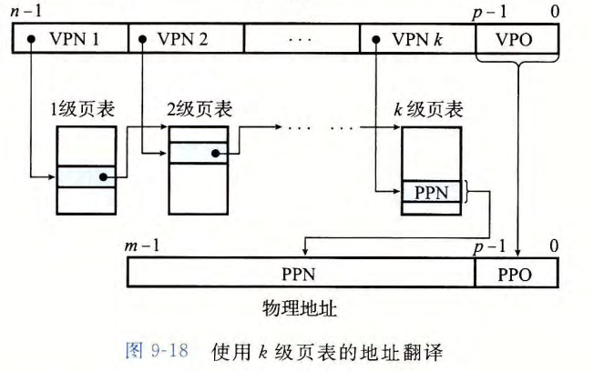

#  虚拟内存

[TOC]

## 物理和虚拟寻址

* 物理寻址：访问DRAM内存中实际地址指向的字节
* 虚拟寻址：先进行地址翻译转化为物理地址，再访问主存
  * CPU上**内存管理单元**（MMU）：存放在主存中的*查询表*来动态翻译虚拟地址，表的内容由操作系统管理

## 地址空间

地址空间：非负整数地址的有序集合

* 如果地址空间中整数是连续的，那么就是**线性地址空间**
* 物理/虚拟地址空间：物理内存/虚拟内存的字节数组
* 主存中的每字节都有一个选自虚拟地址空间的虚拟地址和选自物理地址空间的物理地址

## 虚拟内存作为缓存的工具

目的：利用DRAM缓存来自通常更大的虚拟地址空间的页面

虚拟内存被组织为一个由存放在 *磁盘* 上的 $N$ 个连续的字节大小的单元组成的数组。每字节都有一个唯一的虚拟地址。

VM系统将虚拟内存（磁盘）分割为**虚拟页**（Virtual Page, VP），物理内存（DRAM）被分割为**物理页**（Physical Page, PP），大小 $P=2^p$

虚拟页可以分为：

- *未分配的*：还没有和磁盘中的某个磁盘空间建立对应关系，虚存系统未分配/创建
- *缓存的*：虚拟页中的数据已缓存到物理内存
- *未缓存的* ： 虚拟页中的数据还未缓存到物理内存

### DRAM缓存的组织结构

* SRAM缓存：CPU和主存之间的L1、L2、L3高速缓存
* DRAM缓存：虚拟内存系统的缓存，在主存中缓存虚拟页

由于访问磁盘的开销很大，DRAM缓存不命中的开销比SRAM缓存不命中的开销大得多。所以虚拟内存的特征：

- 虚拟页往往很大，通常是4KB~2MB
- DRAM缓存是全相联（$E=C/B$，一个组内包含了所有的行），任何虚拟页都可以放置在任何的物理页中
- DRAM缓存 **不会直写** 磁盘，总会写回+写分配，尽可能将写回磁盘的操作延迟

### 页表

需要确定虚拟页是否缓存在DRAM中、具体缓存在哪里、不命中是应该从磁盘中哪个位置取

功能实现：操作系统软件、MMU中的地址翻译硬件和存放在物理内存中的 **页表** 结构

* 页表将虚拟页映射到物理页，每次地址翻译硬件将一个虚拟地址转换为物理地址时，都会读取页表。

* 页表就是一个 *页表条目*（Page Table Entry， PTE）的数组。

  

* 页表条目由 **有效位** 和 $n$ 位地址字段组成，有效位表明该虚拟页当前是否缓存在DRAM中，若设置有效位，则地址指向DRAM中相应物理页的起始地址

  | 有效位 |  地址位  |      效果      |
  | :----: | :------: | :------------: |
  |   0    |   Any    |     未分配     |
  |   1    |   null   | 已分配，未缓存 |
  |   1    | not null | 已分配，已缓存 |

  

地址翻译硬件将虚拟地址作为一个索引来定位PTE，并从内存中读取它

* **页命中**：若设置了有效位，页命中（虚拟页的数据是否缓存到物理内存中），从相应PTE中读取物理内存地址

  

  

* **缺页**：若未设置有效位，DRAM缓存不命中，触发一个**缺页异常**，缺页异常调用内核中的缺页异常处理程序

  异常处理程序将对应的虚拟页复制到物理内存中的牺牲页，若牺牲页被修改，则将其复制回磁盘（写回），随后返回到当前指令，此时页命中。

  

  * **页面调度**：磁盘和内存之间传送页的活动，页从磁盘 *页面调入* 或 *页面调出* 磁盘
  * 不命中发生时才换入页面的策略为 **按需页面调度**

  

**分配页面**：调用`malloc`产生的底层操作是在 *磁盘* 中分配虚拟页，并更新 *页表* 中对应的PTE

### 局部性

* 局部性原则保证了在任意时刻，程序将趋向于在一个较小的**活动页面**集合上工作，这个集合叫做**工作集**
* 如果工作集的大小超出了物理内存的大小，那么这时页面将不断地自DRAM换进换出（抖动），导致程序性能下降

## 虚拟内存作为内存管理的工具

**每个进程都有一个独立的地址空间**

* 操作系统为每个进程提供了一个独立的页表
* 多个虚拟页面可以映射到同一个共享物理页面上：

VM简化了链接和加载、代码和数据共享，以及应用程序的内存分配：

1. **简化链接**
   * 由于地址空间的一致性，不管代码和数据实际存放在物理内存何处，每个进程都使用相同的内存映像格式（如代码段总是从`0x400000`开始等）
   * 一致性简化了链接器的设计和实现，允许链接器生成 **完全链接** 的可执行文件，可执行文件是独立于物理内存中代码和数据的最终位置
2. **简化加载**
   * 使得容易向内存中加载可执行文件和共享对象文件：加载`.text`和`.data`时，Linux加载器为代码和数据段分配虚拟页，把他们标记为未被缓存的，再将页表条目指向目标文件中适当的位置。
   * 加载器不从磁盘到内存实际复制任何数据，每个页初次被引用时，虚拟内存系统会自动按要求调入数据页
   * *内存映射*：`mmap`，将一组连续的虚拟页映射到任意一个文件中的任意位置
3. **简化共享**
   * 操作系统通过将不同进程中适当的虚拟页面映射到相同的物理页面，从而安排多个进程共享这部分代码的一个副本（共享库）
4. **简化内存分配**
   * 分配额外的堆空间时，操作系统没有必要分配**连续**的物理页面，页面可以随机地分散在物理内存中

## 虚拟内存作为内存保护的工具

用户进程对虚拟地址空间中的数据读写有权限约束：

- 不能修改只读代码段
- 不能读、写内核的代码
- 不能读、写其他进程的私有内存
- 不能修改与其他进程共享的虚拟页面，除非所有共享者显式地允许它这么做（进程间通信）

内部进制是通过在PTE上添加额外的**许可位**来实现读、写的权限约束。

- SUP位表示进程是否必须运行在内核（超级用户）模式下才能访问该页，用户态的进程只能访问SUP为0的页面
- READ位和WRITE位控制对页面的读和写访问
- 指令违反这些条件时，CPU触发 *段错误*

## 地址翻译

重点：**把VPN翻译成PPN**

基本符号：

* 虚拟地址空间：$V(VAS)=\{0,1,\dots,N-1\}$
* 物理地址空间：$P(PAS)=\{0,1,\dots,M-1\}$
* 地址翻译：$MAP:\ V \rightarrow P \cup \{\varnothing\}$，对于虚拟地址 $\alpha$：
  * $MAP(\alpha) = \alpha'$，如果虚拟地址 $\alpha$ 处的数据在 $PAS$ 的物理地址 $\alpha'$ 处
  * $MAP(\alpha)=\varnothing$，如果果 $\alpha$ 处的数据在 $PAS$ 的物理地址 $\alpha'$ 处
* $N=2^n$：虚拟地址空间的地址数量
* $M=2^m$：物理地址空间的地址数量
* 虚拟地址组成成分：**VPO**（虚拟页面偏移量）、**VPN**（虚拟页号）、**TLBI**（TLB索引）、**TLBT**（TLB标记）
* 物理地址组成成分：**PPO**（物理页面偏移量）、**PPN**（物理页号）、**CO**（缓冲块内的字节偏移量）、**CI**（高速缓存索引）、**CT**（高速缓存标记）

* $n$ 位的虚拟地址分为两个部分：$p$ 位的 *虚拟页面偏移*、$(n-p)$ 位的 *虚拟页号*
* **页表基址寄存器** 指向当前页表
* VPO = PPO

### 页面命中

1. 处理器生成虚拟地址，传送给MMU
2. MMU生成PTE地址，从高速缓存 / 主存请求得到它
3. 高速缓存 / 主存向MMU返回PTE，检测到PTE的有效位为1
4. MMU构造物理地址，传送给高速缓存 / 主存
5. 高速缓存 / 主存把请求的数据字返回给处理器

### 页面未命中

1 - 3相同，3中检测到PTE的有效位为0

4. PTE有效位是0，MMU触发异常，控制交给内核的缺页异常处理程序
5. 处理程序确定物理内存的牺牲页并牺牲它
6. 处理程序调入新的页面，更新内存中的PTE
7. 处理程序返回原来的进程，再次执行导致缺页的指令

### 结合高速缓存和虚拟内存

相当于L1 cache缓存了PTEA到PTE的映射、PA到数据的映射

### 利用TLB加速地址翻译

* 每次CPU产生一个虚拟地址，MMU就必须从内存查阅一个PTE，如果此时PTE不命中，耽误时间

* MMU中包括了一个关于PTE的小的缓存，称为**翻译后备缓冲器**（TLB）

* TLB结构和cache相似，用于缓存VPN到PTE的映射，其中每一行都保存着一个由单个PTE组成的块，相联度高（组少）

* MMU使用虚拟地址的VPN部分来访问TLB：

  

  （类似于cache：标记-组索引-块偏移）

命中：CPU产生虚拟地址，MMU从TLB中取出PTE

不命中：MMU从L1缓存中取出PTE并将其存放在TLB中

* 一般情况下很少会不命中：相联度高

### 多级页表

使用一个单独的页表来进行地址翻译，会导致页表非常大

* 例：48位地址空间，每个页4KB，每个页表条目为8字节，需要512GB的页表

因此通常使用层次结构的页表（多级页表）

例：二级页表

多级页表相当于树结构，它从两个方面减少了内存要求：

- 如果一级页表中的一个PTE是空的，相应的二级页表就不会存在
- 只有一级页表才需要总是在主存中。虚拟内存系统可以在需要时创建、页面调入或调出二级页表

**k级页表层次结构的地址翻译**：

* 虚拟地址划分为 $k$ 个VPN和1个VPO
* 每个VPN $i$ 都是一个到第 $i$ 级页表的索引
* 为了构造物理地址，在能够确定PPN之前，MMU必须访问 $k$ 个PTE

通过将不同层次上页表的PTE缓存起来，使得带多级页表的地址翻译并不比单级页表慢很多