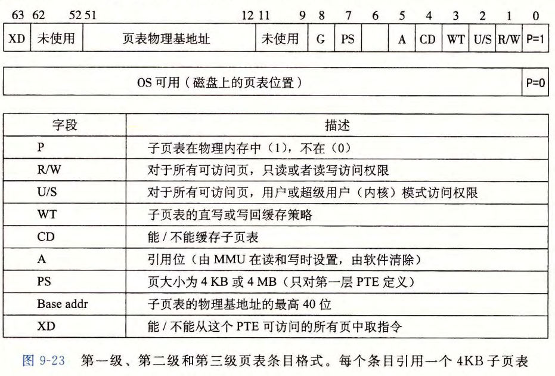

# Virtual Memory Systems


[TOC]


## 内容回顾+案例分析

假设：

* 系统：TLB + L1 d-cache
* 内存按字节寻址
* 内存访问单位为1字节
* 虚拟地址14位，物理地址12位，页面大小64字节
* TLB四路组相联，共16个条目（四个组）
* L1 d-cache物理寻址、直接映射，行大小为4字节，共有16个组，能存一个页


分析：

1. **VPO、PPO**：低6位；VPN：高8位；PPN：高6位
2. **TLB**：利用VPN进行寻址——VPN高4位为TLBT标记，低2位为TLBI组索引
3. **高速缓存**：低2位为块偏移，后4位是组索引，剩下6位为标记
4. **页表**：条目数为 $2^{14-6}=256$，只存着PPN、有效位（**VPN不是页表的一部分！**）

以上图为例：假设执行：

* `movq 0x03d4 %rax`（读地址`0x03d4`处的数据）

0. 分析虚拟地址：`VA = 0x03d4 = 00 0011 1101 0100, VPN = 0x0f, VPO = 0x14, TLBT = 0x03, TLBI = 0x03`

    

1. 去找TLB中第`TLBI = 0x03`的组里标记为`TLBT`的条目（第二个匹配，内容为`0D`），TLB中命中，将缓存的PPN（`0D`）返回给MMU

   * 如果不命中，去主存中的页表里找相应的PTE

2. 检查有效位：有效位为1，进入下一步

   * 如果有效位为0，触发段错误，控制交给内核的 *缺页异常处理程序*；程序经过一系列处理（**内存中**（不是L1）确定牺牲页、可能的写回、更新PTE）后重新执行引发错误的指令

3. MMU将PPN的`0x0D`和VPO的`0x14`连接起来，得到`0011 0101 0100 = 0x354`，即为物理地址

4. MMU把物理地址传给缓存，缓存经过一系列操作（cache相关内容）读出`0x36`，传回MMU，再传回CPU


## Inter Core i7 / Linux 内存系统


地址：支持48位（256TB）虚拟地址空间、52位（4PB）物理地址空间

**处理器封装**：包括四个核、一个大的所有核共享的L3高速缓存、一个DDR3内存控制器

* 每个核包含一个层次结构的TLB、一个层次结构的数据和指令的高速缓存一组快速的点到点的基于QuickPath技术的链路
* TLB四路组相联
* 高速缓存块大小为64字节，L1、L2为八路组相联，L3为16路
* 页大小可以在启动时被配置为4KB或4MB，Linux为4KB


### Core i7 地址翻译

* Core i7采用 **四级页表** 层次结构
* 每个进程有它自己私有的页表层次结构
* 允许页表换进换出，但是与已分配了的页相关联的页表都是驻留在内存中的
* CR3控制寄存器指向第一级页表（L1）的起始位置，其值是每个进程上下文的一部分（每次上下文切换时都会被恢复）
  * CR3也被称为PDBR，**页表基址寄存器**

**页表条目格式**

* 第一、二、三级：

  

  * `P = 1`时，地址字段中包含的PPN就是有效的，指向适当的**页表**开始处

* 第四级：

  

  * `P = 1`时，地址字段中包含的PPN就是有效的，指向**物理内存中某一页的基地址**

* PS只对第一级定义

* 三个权限位：R / W：读写；U / S：用户或内核模式；XD：64位系统中引入，禁止从内存页取指令，一定程度防止缓冲区溢出攻击

* A位：**引用位**，MMU翻译虚拟地址时设置，内核缺页处理程序会用这个为来实现页替换算法

* D位：**修改位**，告诉内核这个页被牺牲时，是否应该写回


翻译过程：48位的VA分为36位的VPN和12位VPO，36位VPN划分为四个9位的片，每个片被用作一个页表的偏移量

CR3寄存器包含L1页表的物理地址，VPN1提供到一个L1 PTE的偏移量，这个PTE包含L2页表的基地址；VPN2提供到一个L2 PTE的偏移量，以此类推


**优化地址翻译**

* 每个物理地址有6位块偏移和6位组索引，对应12位的PPO，也就是PPO。所以CPU产生虚拟地址时，把VPO直接发送给L1高速缓存就行


### Linux 虚拟内存系统


#### Linux 虚拟内存区域

* Linux将虚拟内存组织成一些 **区域**（段）的集合，一个区域就是已经存在着的已分配的虚拟内存的连续片
* 代码段、数据段、堆、共享库段、用户栈都是不同的区域，每个存在的虚拟页面都保存在某个区域中，不存在不属于某个区域的虚拟页
* 区域允许虚拟地址空间有间隙，内核不用记录不存在的虚拟页
* 内核为系统中的每个进程维护一个单独的任务结构`task_struct`，任务结构中的元素包含或指向内核运行该进程所需要的所有信息（PID，指向用户栈的指针，可执行目标文件的名称，PC）


* `mm_struct`：描述虚拟内存当前状态
* `pgd`：第一级页表（页全局目录）的基址，`mmap`指向区域结构链表`vm_area_structs`
* 每个`vm_area_structs`都描述了当前虚拟地址空间的一个区域。内存运行这个进程时，就将`pgd`存放在CR3控制寄存器中
  * `vm_start`：这个区域的起始处
  * `vm_end`：这个区域的结束处
  * `vm_prot`：这个区域内包含的所有页的读写许可权限
  * `vm_flags`：这个区域内的页面与其他进程共享 / 私有（以及其他信息）
  * `vm_next`：链表中下一个数据结构


#### Linux 缺页异常处理

假设试图翻译虚拟地址A时触发缺页：

1. A是否合法：搜索区域结构链表，把A和每个区域结构中的`vm_start`和`vm_end`作比较。指令不合法，则触发段错误：访问一个不存在的页面
2. 试图进行的内存访问是否合法：不合法则触发保护异常
3. 正常缺页：选择一个牺牲页面，交换，换入新的页并过呢更新页表，返回引起缺页的指令


## 内存映射

Linux通过将一个虚拟内存区域与一个磁盘上的 *对象* 关联起来，以初始化这个虚拟内存区域的内容，这个过程称为 **内存映射**。两种映射目标：

1. Linux文件系统中的普通文件：如可执行文件，从文件的一块映射到虚拟页面，内容不够就补0
2. **匿名文件**（匿名页）：如栈，由内核创建，全为0（请求二进制零的页）。引用时磁盘和内存之间没有实际的数据传送

**交换空间**：弥补物理内存不够用的情况：一旦一个虚拟页面被初始化了，它就在一个内核维护的 *交换文件*（交换空间）中换来换去（将磁盘空间虚拟成内存来使用）


### 共享对象

* **共享对象**：进程对这个区域的写操作，其他进程也可见；**私有对象**：写操作对其他进程不可见

* 不同的进程将一个相同的共享对象分别映射到自己地址空间里，映射到的虚拟地址不一定相同（但是差为页大小的整数倍），物理内存中只需要存放共享对象的一个副本

* 私有对象：**写时复制**

  区域结构被标记为私有的写时复制时，只要没有进程试图写它自己的私有区域，它们就可以继续共享物理内存中对象的一个单独副本

  如果某进程试图写其中的某个页面，就会触发一个保护故障，故障处理程序会在物理内存中创建这个页面的一个 **新副本** ，更新页表条目指向这个新的副本，然后恢复这个页面的可写权限，控制传送给引发异常的指令

  通过延迟私有对象的复制，充分节约物理内存


### fork函数

* 被当前进程调用时，内核为 *新进程* 创建各种数据结构，分配PID；创建`mm_struct`、区域结构和页表的原样副本
* 将两个进程中的每个页面都标记为**只读**
* 将两个进程中的每个区域结构都标记为**私有的写时复制**
* `fork`返回时，两个进程的虚拟内存相同
  * 进行写操作时才会复制、产生新页面


### execve函数

假设执行`execve("a.out", NULL, NULL)`

* *删除已存在的用户区域*
* *映射私有区域*：为新程序的代码、数据、`bss`、栈区域创建新的区域结构，这些新区域都是私有、写时复制；代码由`.text`映射，数据由`.data`映射，`bss`为匿名页，栈、堆都为初始长度为0匿名页
* *映射共享区域*：处理动态链接，映射到用户虚拟地址空间的共享区域内
* *设置PC*：指向代码区域入口


### 用户级内存映射：mmap函数

```c
void *mmap(void *start, size_t length, int prot, int flags, int fd, off_t offset)
```

* 返回值：成功则为指向映射区域的指针，出错则为`MAP_FAILED(-1)`

* 要求内核创建一个新的虚拟内存区域，最好是从地址`start`开始，并将文件描述符`fd`指定的对象的一个连续的片映射到这个新的区域。连续的对象片大小为`length`字节，从距文件开始处偏移量为`offset`字节的地方开始

* `start`只是一个暗示，通常为`NULL`，此时让内核自行分配

* `prot`：新映射的虚拟内存区域的访问权限位`vm_prot`：

  `PROT_EXEC`：这个区域内的页面由可以被CPU执行的指令组成

  `PROT_READ`：可读；`PROT_WRITE`：可写；`PROT_NONE`：不能被访问

* `flag`：描述被映射对象类型的位

  `MAP_ANON`匿名对象，`MAP_PRIVATE`私有写时复制，`MAP_SHARED`共享


`munmap`删除虚拟内存的区域：

`int munmap(void *start, size_t length)`，成功返回0，出错返回1

* 删除从虚拟地址`start`开始、由接下来`length`字节组成的区域。引用已删除区域会导致段错误
