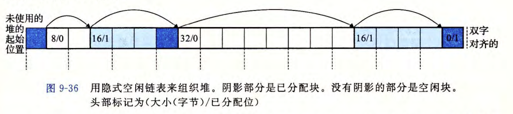

# Dynamic Memory Allocation


[TOC]


## 动态内存分配

* 程序使用 **动态内存分配器** 维护进程的虚拟内存区域

* 内核维护变量`brk`指向堆的顶部

* 分配器将堆视为一组不同大小的块的集合，每个块是一个连续的虚拟内存片，要么是*已分配的*，要么是*空闲的*

  两者风格：

  * **显式分配器**：要求应用显式地释放任何已分配的块，如`malloc | free, new | delete`
  * **隐式分配器**：应用分配，但是不用显式释放。分配器会检测不再使用的块，并将其释放：Java, Lisp, ML


### malloc 和 free 函数

```c
void *malloc(size_t size);
```

* 返回：成功则为已分配块的指针，出错为NULL并设置`errno`
* 32位，块地址为8的倍数；64位，块地址为16的倍数
* 出错：要求的内存块比虚拟内存还大
* `calloc`：瘦包装，将分配的内存初始化为0
* `realloc`：改变以前已分配块的大小

```c
void *sbrk(intptr_t incr);
```

* 返回：成功则为`brk`旧值，出错为-1，并将`errno`设置为ENOMEM
* 通过将内存的`brk`指针增加`incr`来扩展和收缩堆

```c
void free(void *ptr);
```

* `ptr`必须指向从`malloc, calloc, realloc`获得的已分配块的起始位置，否则为未定义
* *什么都不返回*，错误无法获知

`malloc`会按照地址，寻找足够大的空位并进行使用分配；具有 **对齐** 要求，会额外分配以按要求对齐地址

**使用动态分配**：自由控制要使用的数组大小等


### 分配器的要求和目标

显式分配器的要求：

* **处理任意请求序列**：每个释放一定对应一个之前动态分配的块，不能假设所有的分配都有相匹配的释放 / 相匹配的分配和空闲请求是嵌套的
* **立即响应请求**：不能为了提高性能而将请求序列进行重排列 / 缓冲
* **只使用堆**
* **对齐块**：x86-64在64位系统上保持16位对齐
* **不修改已分配的块**：只能操作或改变空闲块，不能压缩已分配块；一旦块被分配，便与分配器无关

目标：吞吐率最大化、内存利用率最大化

* **吞吐率最大化**：开发一个性能合理的分配器：分配和释放请求的平均时间最小化

  合理性能：分配请求的最糟运行时间和空闲块的数量成正比关系，释放请求运行时间为常数
  
* **内存利用率最大化**：*峰值利用率* 最大化：历史利用率的最大值最小
  $$
  U_k = \frac{\max_{i \leqslant k} P_i}{H_k}
  $$


### 碎片

碎片：有未使用的内存，但不能用来满足分配请求

* **内部碎片**：分配的空间比有效载荷大，如为了内存对齐而额外分配的空间
  * 量化简单明了，取决于以前请求的模式和分配器的实现方式
* **外部碎片**：空闲内存累计起来能分配，但是没有单独的空闲块不够大
  * 难以量化且无法预测（还取决于将来请求的模式），使用启发式策略来维持少量的大空闲块


## 实现动态内存分配

* 空闲块组织：记录空闲块
* 放置：选择分配的位置
* 分割：放置后处理剩下的空闲空间
* 合并：处理刚被释放的快

少写点了，全在malloc lab里了

**字**：四字节，双字为八字节，比汇编里大一倍


### 隐式空闲链表

块的结构：头部+有效载荷+填充

* 头部：假设块双字对齐，大小不会超过32位，则块的大小信息只需要29位就能存下（剩下的三位必定为0）。

  头部为存储块信息的32位空间，其中29位存大小，剩下三位可以用来存多余的信息，此处用最低位存储该块是否被分配，1为分配0为空闲

* 有效载荷：`malloc`实际请求可用的空间，大小为双字的整数倍

* 填充：可用于满足对齐要求

通过头部存储的大小信息，可以实现按照地址顺序实现块的遍历



优点：简单

缺点：操作开销大，搜索时间和和块总数呈线性关系

**放置策略**：首次适配、下一次适配（记录当前适配的位置）、最佳适配，再碎片和时间之间权衡

合并空间块：立即合并、推迟合并

**带边界标记的合并**：加入脚部，存储内容和头部相同，合并时四种情况：前后都已分配、前面已分配、后面已分配、前后均未分配

* **去脚部**：空闲块才需要脚部，已分配块中删除脚部，头 / 脚部中用另一个位额外存储“上一个块是否被分配”的信息


堆设计：

* **序言块**：大小为两个字的块，包含头部和脚部，块大小为一个字
* **结尾块**：只有一个字的脚部，块大小为0


### 显式空闲链表

在空块中存放指向前一个空块的指针和指向后一个空块的指针

维护链表：后进先出、按地址顺序维护

* 优点：大幅降低搜索时间复杂度：变为空闲块数量的线性函数
* 缺点：空闲块大小增加，提高内部碎片


### 分离空闲链表

将空闲块按照大小安置在不同的链表中

* 简单分离存储：块大小均为最大值，每次将申请的页划分成相同大小的空块，单向链表、不分割、合并空闲块、快但外部碎片多
* 分离适配：显式 + 分类，`GNU malloc`的办法，效率高
* 伙伴系统：大小类都是2的幂，二分递归，找伙伴很简单（只有一位不同），搜索和合并快但内部碎片多


## 垃圾收集

* 垃圾：程序不再需要的已分配块
* **垃圾收集器**：隐式分配器，能够自动回收堆存储的动态内存分配器
* 定期识别垃圾快，相应的调用`free`


垃圾收集器将内存视为一张 *有向可达图*，节点被分为根节点和堆节点

* 堆节点对应堆中已分配块，有向边 $p \rightarrow q$ 代表块 $p$ 中某个位置指向块 $q$ 中某个位置，根节点不在堆中（寄存器、栈里的变量、虚拟内存中读写数据区域内的全局变量），指向堆中块

* 根节点到堆节点有路径，说明这个堆不是垃圾

* ML和Java对如何创建和使用指针有严格的控制，可以维护可达图，能回收所有垃圾；C和C++的收集器通常不能维持可大图的精确表示，可能错误标记，叫做 **保守的垃圾收集器**

  

  （用收集器代替调用`free`）


### Mark & Sweep 垃圾收集器

* 由标记阶段和清除阶段组成，标记阶段标记出根节点的所有可达的和可分配的后继，后面的清除阶段释放每个未被标记的已分配块

* 块头部空闲的低位中拿一位来标记这个块是否被清除

* **标记阶段**：对每个根节点调用`mark`函数：如果节点指向的是一个已分配且未标记的堆块，标记它，并对它中的每个字都递归调用自己。

* **清除阶段**：调用`sweep`函数：在堆上每个块上反复循环，释放遇到的所有未标记的已分配块

  例：开始时有6个已分配块，未标记

  

* **难点**：判断指针指向的是不是已分配块中的某个字：是不是指针、指的是什么

  * 指的是什么：将已分配块集合维护成一颗平衡二叉树，左子树中所有块都放在较小的地址处，右子树地址较大，二分查找可判断是否在已分配块中
  * 是不是指针：没有明显方式解决，其他类型的数据也能伪装成指针，只有把块保守的标记为可达


## C程序中常见错误

1. 间接引用坏指针：`scanf("%d",val);`
2. 读未初始化的内存
3. 允许栈缓冲区溢出：`gets()`
4. 假设指针和他们指向的对象的大小相同
5. 错位错误：`for(int i = 0; i <= n; i++)`
6. 引用指针，而不是它所指向的对象：`*size--`为减少指针的大小，`(*size)--`为减少指针指向的数的大小
7. 指针运算：实际加减字节数为指向的数据的大小
8. 引用不存在的变量：函数返回指向临时变量的指针
9. 引用空闲堆中的数据：`free`后仍然使用堆中数据
10. 内存泄漏

