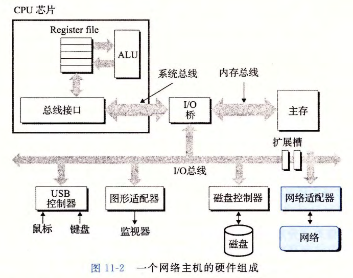
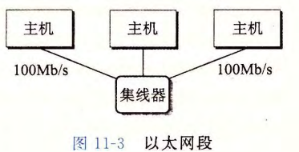
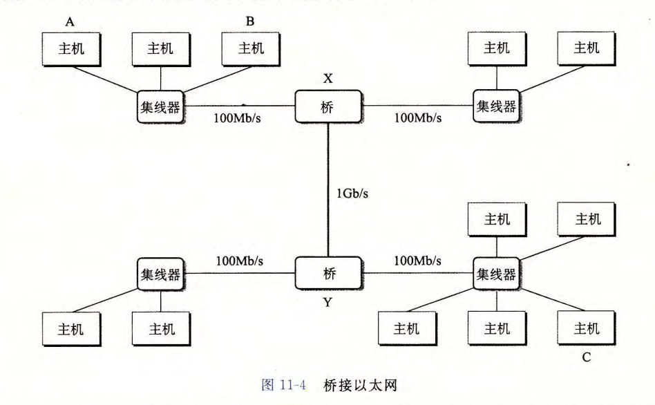
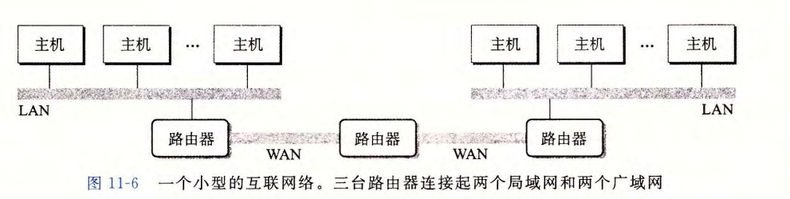
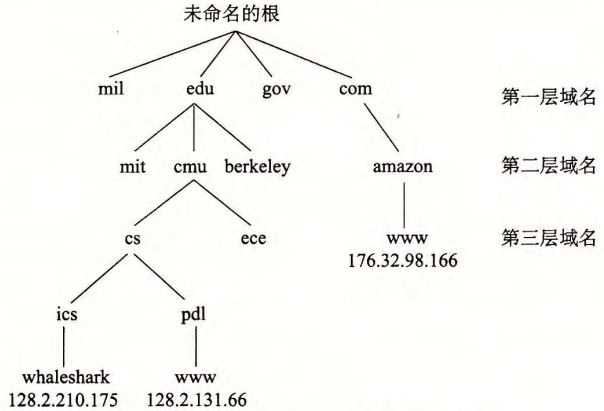
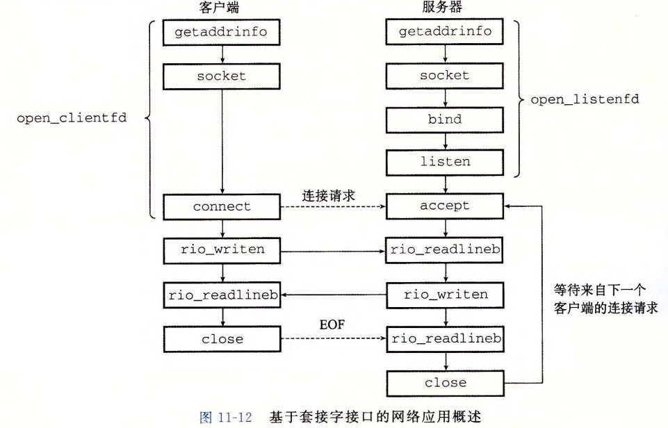
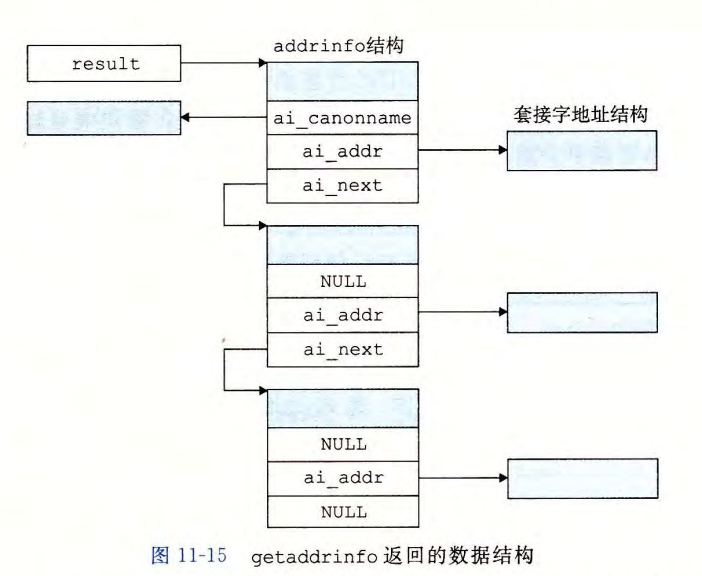

# Network Programming


[TOC]


## 客户端 - 服务器编程模型

一个应用是由一个 *服务器进程* 和一个或多个 *客户端进程* 组成。服务器管理某种 *资源*，并且通过操作这种资源来为它的客户端提供某种服务

客户端-服务器模型中的基本操作是 **事务**：

1. 客户端需要服务时，向服务器发送一个 *请求* ，发起一个事务
2. 服务器对收到的请求进行解释，并以适当的方式操作资源
3. 服务器给客户端发送一个 *响应*，等待下一个请求
4. 客户端收到响应并处理

* 一台主机可以同时运行多个客户端和服务器（进程），一个客户端和服务器的事务可以在同一台或不同主机上


## 网络

客户端和服务器通常运行在不同的主机上，并且通过 *计算机网络* 的硬件和软件资源来通信

主机：网络只是一种 I/O 设备，是数据源和数据接收方。



物理：按照地理远近组成的层次系统，最低是LAN（局域网），最流行的技术是以太网（Ethernet）


### 以太网段

以太网的最低层次



- 以太网段包括一些电缆和**集线器**
- 每根电缆一头连接主机的适配器，一头连接在集线器的一个**端口**上
- 集线器不加分辨地将从一个端口上收到的每个位复制到其他所有的端口上，每台主机都能看到每个位
- 一个以太网段就是一个LAN，通常跨越一个房间或者楼层


- 每个适配器都有一个48位地址
- 数据发送形式：**帧**（frame），帧包括一些固定数量的 *头部* 位（源、目的地址、此帧的长度）和 *有效载荷*
- 每个主机适配器都能看到这个帧，但只有目的主机实际读取它


### 以太网

网桥：



* 利用电缆和 *网桥*，将多个以太网段连接成较大的局域网
* 网桥会有选择地复制帧


**路由器**：特殊计算机，连接多个不兼容的局域网，组成 **互联网络**（internet），每台路由器对于它所连接到的每个网络都有一个适配器（端口）



解决不兼容问题：**协议软件**：协议控制主机和路由器如何协同工作来实现数据传输，消除不同网络之间的差异

* 命名机制：不同的局域网技术用不同的方式来为主机分配地址，协议要指定一种一致的主机地址格式。每台主机会被分配至少一个 *互联网网络地址*，唯一标识这台主机
* 传送机制：不同联网技术发送数据的方式不同。协议将数据位捆扎成不连续的片（**包**），消除差异。包由 *包头* 和 *有效载荷* 组成，包头包含包的大小、源主机地址、目的主机地址

传送过程：

* LAN1：客户端主机内核复制数据，主机上协议软件附加包头和LAN1帧头，主机的LAN1适配器将帧复制到网络上，传给路由器
* 路由器：确定转发方向，路由器内的协议程序去LAN1帧头，加上LAN2帧头，发到LAN2
* LAN2：传输，服务端主机适配器读到该帧，传给协议程序，协议程序去LAN2帧头、包头，将数据复制给服务器主机

问题：不同网络的帧大小最大值会不同、路由器如何转发帧、网络拓扑变化时如何通知路由器、丢包等


## 全球IP因特网

每台Internet主机都运行实现 **TCP/IP协议**（传输控制协议 / 互连网络协议）的软件

* 通信方式：**套接字接口** 函数和 Unix I/O 函数，函数运行在内核态
* IP协议：基本命名方法和递送机制，能从一台Internet主机向其他主机发送包（叫做 *数据报* Datagram）
  * 不可靠：丢包或者重复时不会试图恢复
* UDP（不可靠数据报协议）：包可以在进程间传送
* TCP：进程间可靠的全双工连接

因特网可以看成世界范围内的主机集合：

* 主机集合被映射为一组32位的IP地址
* IP地址被映射为称为 **因特网域名** 的标识符
* IP用来标记主机的网卡，而非主机
* 进程通过 *连接* 和其他主机上的进程通信
* IPV4：32位；IPV6：128位


### IP地址

```c
struct in_addr
{
    uint32_t s_addr;
}
```

* 存在结构体中

* **网络字节顺序**：大端字节顺序，IP地址结构中存放的地址总是大端法存储

* 大小端转换：

  ```c
  uint32_t htonl(uint32_t hostlong);
  uint16_t htons(uint16_t hostshort); // 主机转化为网络
  uint32_t ntohl(uint32_t hostlong);
  uint16_t ntohs(uint16_t hostshort); // 网络转化为主机
  ```

* 标识：**点分十进制表示法**，每个字节由它的十进制值标识，用 . 和其他字节分开

  相互转换：

  ```c
  int inet_pton(AF_INET, const char *src, void *dst);
  // 返回: 成功为1, src内容非法则为0, 出错-1并设置errno
  const char *inet_ntop(AF_INET, const void *src, char *dst, socklen_t size);
  // 返回: 成功则为指向点分十进制字符串的指针, 出错NULL
  ```


### 因特网域名

**域名**：用据点分割的单词（字母、数字、破折号）（网址）

* 定义域名映射到IP地址的机制：域名集合形成层次结构（树结构），树节点为域名，反向到根的路径形成域名

  

* 子树：*子域*

* 维护：DNS（Domain Name System，域名系统），由 *主机条目结构* 组成，每条主机条目就是一个域名和IP地址的等价类

* `nslookup`查看DNS映射的属性：

  * `localhost`：回送地址`127.0.0.1`，本机同时运行客户端和服务器时有用
  * `hostname`：本机的实际域名
  * 通常域名和IP地址一一映射，某些情况下多个域名对一个IP地址，或多个域名对同一组的多个IP，也有合法域名没有IP地址


### 因特网连接

点对点、全双工连接，可靠的（保证顺序不变）

**套接字**：

* 连接的一个端点，每个套接字都有相应的套接字地址

* 套接字地址：IP地址+16位整数端口，表示为“地址：端口”

* 客户端发起连接请求时，客户端套接字地址中的端口由内核自动分配，为 **临时端口**

* 服务器套接字地址中的端口通常是 **知名端口**，和服务相对应

  * Web服务器通常使用80，服务名http
  * 电子邮件服务器通常使用25，服务名smtp

* 连接由两端的套接字地址唯一确定：**套接字对**，文件`/etc/services`包含知名服务器和知名端口的映射

  `(cliaddr:cliport, servaddr:servport)`

  如：`128.2.194.242:51213, 208.216.181.15:80`

  


## 套接字接口

* 一组函数，和Unix I/O结合起来，用以创建网络应用




### 套接字地址结构

* 套接字：Linux内核：通信的一个端点；Linux程序：有一个相应描述符的打开文件

* IPV4地址结构：

  ```c
  struct sockaddr_in
  {
      uint16_t        sin_family;  // 协议族,对于Internet应用,为AF_INET
      uint16_t        sin_port;    // 端口号,网络字节顺序
      struct in_addr  sin_addr;    // IP地址,网络字节顺序
      unsigned char   sin_zero[8]; // 对齐,以便转换成sockaddr
  }
  ```

* 套接字地址结构：需要能接收各种类型的套接字地址结构

  ```c
  struct sockaddr
  {
      uint16_t   sa_family;   // 协议族
      char       sa_data[14]; // 地址信息
  }
  ```

  * 出现比`void*`晚


### 主机和服务的转换

```c
int getaddrinfo(const char *host, const char *service, const struct addrinfo *hints, struct addinfo **result);
// 返回: 成功为0,出错为非零错误代码
void freeaddrinfo(struct addrinfo *result);
const char* gai_strerror(int errorcode);
// 返回: 错误信息
```


**getaddrinfo**：

* 将主机名、主机地址、服务名、端口号的字符串标识转化成套接字地址结构，可重入，适用于任何协议

* `result`指向一个`addrinfo`结构的链表：

  

```c
struct addrinfo {
    int ai_flags; /* Hints argument flags 掩码, 修改函数行为 */
    int ai_family; /* First arg to socket function 协议族, IPV4 / IPV6 */
    int ai_socktype; /* Second arg to socket function SOCK_STREAM */
    int ai_protocol; /* Third arg to socket function */
    char *ai_canonname; /* Canonical host name */
    size_t ai_addrlen; /* Size of ai_addr struct */
    struct sockaddr *ai_addr; /* Ptr to socket address structure */
    struct addrinfo *ai_next; /* Ptr to next item in linked list */
};

```

* `addinfo`可以直接传递给套接字接口中的函数

**getnameinfo**：

```c
int getnameinfo(const struct sockaddr *sa, socklen_t salen, char *host, size_t hostlen, char *service, size_t servlen, int flags);
// 返回: 成功为0,出错为非零错误代码
```

* 从套接字地址结构返回主机和服务名字符串
