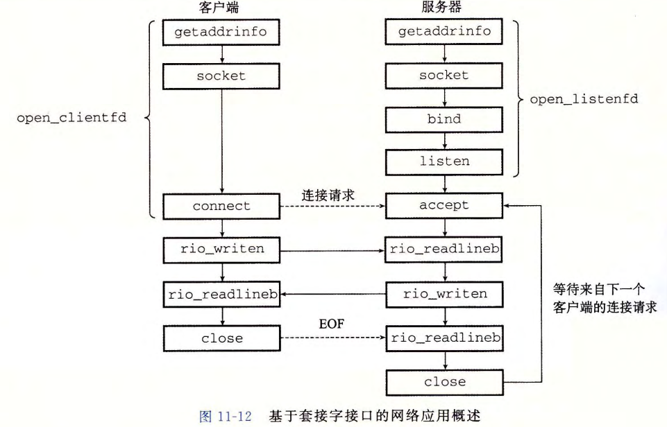

# 23 Network Programming


[TOC]


## 套接字接口

* 一组函数，和Unix I/O结合起来，用以创建网络应用



**socket**

```c
int socket(int domain, int type, int protocol);
// 返回: 成功为非负描述符,出错-1
```

* 创建一个 *套接字描述符*
* 仅是部分打开，不能用于读写
* 最好用`getaddrinfo`生成参数


**connect**

```c
int connect(int clientfd, const struct sockaddr *addr, socklen_t addrlen);
// 返回: 成功0, 出错-1
```

* 客户端调用，建立和套接字地址为`addr`的服务器的连接，`addrlen`是`sizeof(sockaddr_in)`
* `connect`会阻塞直到连接成功或发生错误
* 成功后套接字对：`(x:y, addr.sin_addr:addr/sin_port)`
* 最好用`getaddrinfo`生成参数


**bind**

```c
int bind(int sockfd, const struct sockaddr *addr, socklen_t addrlen);
// 返回: 成功0, 出错-1
```

* 告诉内核将`addr`中服务器套接字地址和套接字描述符`sockfd`联系起来
* 最好用`getaddrinfo`生成参数


**listen**

```c
int listen(int sockfd, int backlog);
// 返回: 成功0, 出错-1
```

* 默认`socket`创建的描述符对应于 *主动套接字*，是连接的客户端上的
* 将一个主动套接字转化为一个 *监听套接字*，指明描述符是给服务器用的
* `backlog`暗示内核在开始拒绝连接请求之前，队列中要排队的未完成的连接请求的数量，一般设置为较大的值（1024）


**accept**

```c
int accept(int listenfd, struct sockaddr *addr, int *addrlen);
// 返回: 成功为非负描述符,出错-1
```

* 等待来自客户端的连接请求到达监听描述符`listenfd`，然后在`addr`中填写客户端的套接字地址，并返回一个 *已连接描述符*，这个描述符可被用来利用Unix I/O函数与客户端通信
* **监听描述符**：
  * 客户端连接请求的一个端点，通常被创建一次
  * 存在于服务器的整个生命周期
* **已连接描述符**：
  * 客户端和服务器之间已经建立起来的连接的一个端点
  * 服务器每次接收连接请求时都会创建一次
  * 只存在于服务器为一个客户端服务的过程中
* 意义：建立并发服务器


`connect`与`accept`功能抽象：

1. 服务器调用`accept`，等待连接请求到达监听描述符`listenfd`
2. 客户端调用`connect`，发送连接请求到`listenfd`
3. `accept`打开新的已连接描述符`connfd`，在`clientfd`和`connfd`之间建立连接，返回`connfd`


### 辅助函数

客户端：`open_clientfd`

```c
int open_clientfd(char *hostname, char *port);
// 返回: 成功为描述符, 出错为-1
```

* 建立与服务器的连接，服务器运行在主机`hostname`上，并在端口号`port`上连接请求

* 返回打开的套接字描述符，能用Unix I/O函数输入输出

  

  1. 为`Getaddrinfo`做准备，定制参数以筛选想要查找的地址信息

     `listp`为`Getaddrinfo`返回的链表结构，链表的每一个元素都是一个地址信息

  2. 遍历链表，对于每一个地址信息，尝试建立一个套接字，然后尝试建立连接，失败就继续遍历。

  3. 全部失败则关闭套接字描述符；进行收尾工作

* 代码和任何版本的IP无关：`socket`和`connect`的参数用`getaddrinfo`自动产生，使得代码干净可移植


服务器端：`open_listenfd`

```c
int open_listenfd(char *port);
// 返回: 成功为描述符, 出错为-1
```

* 服务器创建一个监听描述符，准备好接收连接请求

  

  1. 为`Getaddrinfo`做准备，定制参数以筛选想要查找的地址信息，只查找被动地、指向服务器所在主机地址的任何主机名
  2. 遍历链表，对于每一个地址信息，尝试建立一个套接字，然后尝试绑定
  3. `setsockopt`函数：配置服务器，除去重启服务器之后的30s呆滞，使服务器能被终止、重启和立即开始接收连接请求
  4. 最后将套接字设置为监听状态


### 例：echo客户端和服务器

功能：服务器读入客户端发送的文本，并将其返回

客户端：


* 使用`Open_clientfd()`建立连接，生成套接字对
* 使用`Rio`读写
* 循环终止后客户端关闭描述符，发送EOF到服务器，客户端终止（`Close`可删去，但是留着是好的）
* 客户端和服务器都关闭描述符时连接终止

服务器：


* **迭代服务器**：一次只能处理一个客户端，一次一个地在客户端间迭代
* **并发服务器**：同时处理多个客户端
* `Accept`等待客户端的连接请求到达`listenfd`，随后获取客户端相关信息（*服务器只有在`accept`时才能得知客户端信息*）
* `echo`函数使用`Rio_readlineb()`从套接字读取文本行，再使用`Rio_written()`写回去
* 每次处理完客户端的请求并发送响应后都关闭已连接描述符
* `struct sockaddr_storage`类型而非`sockaddr_in`：`sockaddr_storage`足够大，能装下任何类型的套接字地址，以保持代码的协议无关性


**EOF**：内核检测到的一种条件，程序接受到由`read`返回的零返回码时就会出现

* 磁盘文件：当前文件位置超出文件长度时，发生EOF
* 因特网连接：进程关闭连接它的那一端时，发生EOF；连接另一端的进程试图读取流中最后一个字节之后的字节时会检测到EOF


## Web服务器

### Web基础

* Web客户端和服务器间使用HTTP协议（超文本传输协议）交互，基于文本的应用级协议
  1. Web客户端（浏览器）打开一个到服务器的因特网连接，请求显示某些 *内容*
  2. 服务器响应所请求的内容，然后关闭连接
  3. 浏览器读取这些内容，并显示在屏幕上
* 和常规文件检索服务（如FTP）的却别：可以用超文本标记语言HTML来写。HTML告诉浏览器如何显示这页中的文本和图形对象


### Web内容

**内容**是与一个MIME（多用途网际邮件扩充协议）类型相关的字节序列

* 
* 提供内容的方式：
  * *静态内容*：读取磁盘文件，并把内容返回给客户端，磁盘文件为 *静态内容*，返回过程为 *服务静态内容*
  * *动态内容*：运行可执行文件，并把输出返回给客户端，输出为 *动态内容*，返回过程为 *服务动态内容*
* **URL**：通用资源定位符，Web服务器管理的文件的唯一的名字，如`http://www.cmu.edu:80/index/html`表示主机 `www.cmu.edu` 上一个叫做 `index.html` 的文件，其由监听端口 80 的 Web 服务器管理
  * 可在执行文件的URL可在文件名后包含程序参数，`?`分隔文件名和参数，每个参数用`&`分开
* 后缀中开始的`/`不代表Linux的根目录，而是被请求内容类型的主目录


### HTTP事务

**HTTP请求**

* 组成：一个 *请求行*，跟随零个或多个 *请求报头*，跟随一个空的文本行来终止报头列表

* 请求行的形式：`<method> <URI> <version>`

  * `<method>`：`GET, POST, OPTIONS, HEAD, PUT, DELETE, TRACE`

  * `<uri>`：相应的URL的后缀，包括文件名和可选的参数

  * 请求报头的形式：`header-name: header-data`

  * Host报头在`HTTP/1.1`请求中需要，在`HTTP/1.0`中不需要：

    ```
    GET / HTTP/1.1
    Host: www.cmu.edu
    
    ```

**HTTP响应**

* 组成：一个 *响应行*，跟随零个或多个 *响应报头*，跟随一个终止报头的空行，跟随 *响应主体*
* 响应行的格式：`<version> <status-code> <status-message>`
  * `<version>`：响应的HTTP版本
  * `<status-code>`：3位正整数，指明对请求的处理
  * `<status-message>`：和错误代码等价的英文描述：
* 响应报头：`Content-Type`响应主题中内容的MIME类型，`Content-Length`响应主题的字节大小


### 服务动态内容

**CGI**（通用网关接口）：标准

1. 客户端将程序参数传递给服务器：

   * `?`分隔文件名和参数，`&`分隔参数与参数
   * 参数中不允许有空格，用字符串`"%20"`表示，其他特殊字符也有对应编码

2. 服务器将参数传递给子进程：

   如`GET /cgi/bin/adder?114514&1919810 HTTP/1.1`

   * 调用`fork`创建子进程，调用`execve`再子进程的上下文中执行`/cgi/bin/adder`程序。这种程序称为 **CGI程序**，许多是用Perl脚本编写：CGI脚本
   * 运行前子进程将CGI环境变量`QUERY_STRING`设置为`"114514&1919810"`，`adder`运行时可以用`Linux getenv`来引用

3. 服务器将其他信息传递给子进程：

   * 环境变量

4. 子进程发送输出：

   * 重定向到和客户端相关联的已连接描述符

* 父进程不知道子进程生成的内容和大小，`Content-type`和`Content-length`响应报头和终止报头的空行由子进程生成


## Tiny Web服务器
