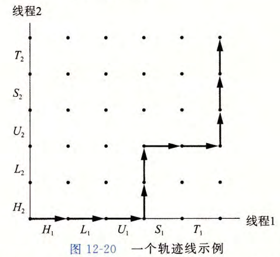
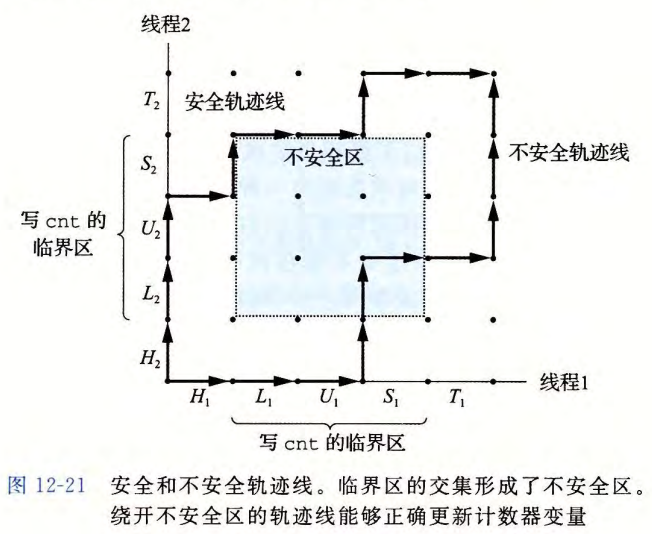
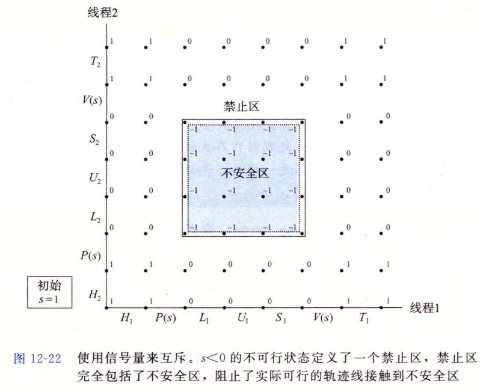

# Synchronization: Basics


[TOC]


## 多线程程序中的共享变量

多线程的C程序中变量根据他们的存储类型倍映射到虚拟内存：

* **全局变量**：虚拟内存的读 / 写区域只包含每个全局变量的一个实例
* **本地自动变量**：定义在函数内部但不`static`，每个线程的栈都包含它自己的所有本地自动变量的实例
* **本地静态变量**：只有一个实例，每个对等线程都读 / 写这个实例


### 共享变量

变量是共享的 $\Leftrightarrow$ 它的一个实例被一个以上的线程引用

* 本地自动变量也能被共享

* 应用：

  ```c
  for (int i = 0; i < N; i++)
  {
      int *p = i;
      Pthread_create(&tids[i], NULL, thread, (void *)p);
  }
  ```

  不安全：`p`是共享的（`thread`读取`p`时，可能读取到`i++`更新后的值）

  正确写法：

  ```c
  for (int i = 0; i < N; i++)
  {
      int *p = Malloc(sizeof(int));
      *p = i;
      Pthread_create(&tids[i], NULL, thread, (void *)p);
  }
  ```

  或者

  ```c
  for (int i = 0; i < N; i++)
  {
      Pthread_create(&tids[i], NULL, thread, (void *)i);
      // thread解析时直接(int)vargp即可
      // sizeof(long) <= sizeof(void*) 时才行
  }
  ```

  * 三种传参的方式：`malloc / free`，传入指向生产者栈的指针，`int`转换


## 用信号量同步线程

```c
/* Global shared variable */
volatile long cnt = 0; /* Counter */
int main(int argc, char **argv)
{
    long niters;
    pthread_t tid1, tid2;
    
    niters = atoi(argv[1]);
    Pthread_create(&tid1, NULL,
    thread, &niters);
    Pthread_create(&tid2, NULL,
    thread, &niters);
    Pthread_join(tid1, NULL);
    Pthread_join(tid2, NULL);
    
    /* Check result */
    if (cnt != (2 * niters))
        printf("BOOM! cnt=%ld\n", cnt);
    else
    	printf("OK cnt=%ld\n", cnt);
    exit(0);
}
/* Thread routine */
void *thread(void *vargp)
{
    long i, niters = 
    *((long *)vargp);
    for (i = 0; i < niters; i++)
		cnt++;
    return NULL;
} 
```

输出不为`niters * 2`：线程的汇编代码：

```assembly
    movq (%rdi), %rcx
    testq %rcx, %rcx
    jle .L2
    movl $0, %rax            # Hi: Head
.L3:
    movq cnt(%rip), %rdx     # Li: Load cnt
    addq $1, %rdx            # Ui: Update cnt
    movq %rdx, cnt(%rip)     # Si: Store cnt
    movq %rdx, cnt(%rip)
    addq $1, %rax
    jne .L3                  # Ti: Tail
.L2:
    
```

运行顺序正确：`L1 U1 S1`必须连续执行，不能被`L2 U2 S2`打断（`L2 U2 S2`同理）：**对共享变量互斥地访问**


### 进度图



* n个进程为n维轨迹线，轴为进程进度，点为进程已经完成某线程的状态，原点为没有指令被执行的初始状态

* 指令执行：从一种状态到另一种状态的转换，只能向上或向右

* **临界区**：`(Li, Ui, Si)`，临界区不应该和其他进程的临界区交替执行：轨迹线不应进入临界区，但是可以擦着临界区的边走

  


## 信号量

* 具有非负整数值的全局变量`s`，两种操作：

  * `P(s)`：如果`s`非零，则将`s`减1，返回；`s`为0，就挂起线程，直到`s`变为非0，`V`会重启这个线程，重启后`P`将`s`减1，返回

    ```c
    while (s == 0)
        wait();
    s--;
    ```

  * `V(s)`：将`s`加1，如果有线程阻塞在`P`且等着`s`变为非零，则`V`会重启这些线程中的一个

    ```c
    s++;
    ```

  * 同一时间，只有一个`P`或一个`V`能改变`s`变量；

  * 多个线程在等待同一个信号量时，无法预测`V`要重启哪个线程

  * *信号量不变性*：信号量不会为负

    ```c
    int sem_init(sem_t *sem, 0, unsigned int value);
    void P(sem_t *s);
    void V(sem_t *s);
    ```

    

### 实现互斥

将每个共享变量（或一组相关的共享变量）与一个信号量`s`（初始为1）联系起来，然后用`P(s), V(s)`将相应的临界区包围起来，这种方式保护变量的信号量叫做 *二元信号量*（值通常为0或1）

* P：加锁

* V：解锁

  ```c
  for (int i = 0; i < niters; i++)
  {
      P(&mutex);
      cnt++;
      V(&mutex);
  }
  ```

  

* 进度图只能解释单处理器上的并发程序，多处理器的系统处于的状态可能不对应于进度图中的任何轨迹线


### 调度共享资源

#### 生产者 - 消费者问题

生产者和消费者线程共享一个有`n`个槽的有限缓冲区，生产者反复生成新的项目并加入缓冲区中，消费者不断从缓冲区中取出这些项目，然后处理

插入和去除项目都涉及更新共享变量，所以必须保证对缓冲区的访问是互斥的，同时要调度对缓冲区的访问：

* 如果缓冲区是满的，生产者必须等待，直到有槽位可用
* 如果缓冲区是空的。消费者必须等待，直到有槽位不为空


```c
typedef struct {
    int *buf;
    sem_t mutex;
    sem_t slots;
    sem_t items;
} sbuf_t;

void sbuf_init(sbuf_t *sp, int n) {
    sp->buf = Calloc(n, sizeof(int));
    Sem_init(&sp->mutex, 0, 1); // buf的互斥锁
    Sem_init(&sp->slots, 0, n); // 开始有n个空槽位
    Sem_init(&sp->items, 0, 0); // 开始没有项目
}

void sbuf_insert(sbuf_t *sp, int item)
{
    P(&sp->slots); // 等待可用槽位
    P(&sp->mutex); // 锁buf
    Insert(buf, item);
    V(&sp->mutex); // 开buf
    V(&sp->items); // 有可用项目 
}

int sbuf_remove(sbuf_t *sp)
{
    int item;
    P(&sp->items);
    P(&sp->mutex);
    item = Remove(sp);
    V(&sp->mutex);
    V(&sp->slots);
    return item;
}
```

* 如果缓冲区大小为1，则不需要互斥锁：缓冲区只有空和满两种状态


#### 读者 - 写者问题

一组并发的线程要访问一个共享对象，有些线程只读对象，其他的修改对象。只读对象的线程为读者，修改对象的为写者。写者必须独占对象，读者可以和其他读者共享对象，考虑有无限多个并发的读者和写者

**第一类**：不让读者等待，除非此时有写者。读者不会因为有写者在等待而等待：

```c
int readcnt;
sem_t mutex, w; // mutex为readcnt的互斥锁

void init(void) {
    readcnt = 0;
    Sem_init(mutex, 0, 1);
    Sem_init(w, 0, 1);
}

void reader(void) {
    while (1) {
        P(&mutex);
        readcnt++;
        if (readcnt == 1)
            P(&w);
        V(&mutex);
        
        // reading happens
        
        P(&mutex);
        readcnt--;
        if (readcnt == 0)
            V(&w);
        V(&mutex);
    }
}

void writer(void) {
    while(1) {
        P(&w);
        
        // writing happens
        
        V(&w);
    }
}
```

**第二类**：写者优先，写者后到达的读者也必须等待这个写者完成

```c
int readcnt, writecnt;
sem_t rmutex, wmutex, r, w;

void init(void) {
    readcnt = writecnt = 0;
    Sem_init(&rmutex, 0, 1);
    Sem_init(&wmutex, 0, 1);
    Sem_init(&r, 0, 1);
    Sem_init(&w, 0, 1);
}

void reader(void) {
    while (1) {
        P(&r);
        P(&rmutex);
        readcnt++;
        if (readcnt == 1)
            P(&w);
        V(&rmutex);
        V(&r);
        
        // reading
        
        P(&rmutex);
        readcnt--;
        if (readcnt == 0)
            V(&w);
        V(&rmutex);
    }
}

void writer(void) {
    while (1) {
        P(&wmutex);
        writecnt++;
        if (writecnt == 1)
            p(&r);
        V(wmutex);
        
        P(&w);
        // writing
        V(&w);
        
        P(&wmutex);
        writecnt--;
        if (writecnt == 0)
            V(&r);
        V(&wmutex);
    }
}
```


* 可能会导致 *饥饿*：一个进程无限期阻塞：假如一个信号量使用了一个LIFO（先进先出）的线程栈，采用 *读者优先*：
* 当一个线程在P中阻塞在一个信号量上，它的ID就被压入栈中；V从栈中弹出栈顶的线程ID，并重启这个线程
* 在它的临界区中竞争的写者会简单的等待，直到它在释放这个信号量之前另一个写者阻塞在这个信号量上
* 如果两个写者来回地传递控制权，正在等待的读者可能会永远地等待下去


* 库函数中对读写的互斥锁：`pthread_rwlock_t`

