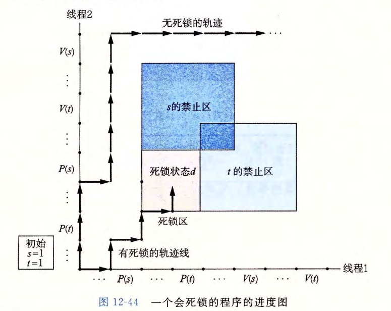

# Synchronization: Advanced

[TOC]

## 使用线程提高并行性

同步（互斥锁）开销巨大，要尽可能避免。如果无可避免，必须要用尽可能多的有用计算弥补这个开销

如：不要用互斥锁保护同一个全局变量，在每个对等线程中用私有变量计算部分和（每个对等线程把部分和累计到一个私有数组元素中）

再优化：累积到一个局部变量中，最后再移动到数组中

### 刻画并行程序的性能

* 线程数 $<$ 核数：时间降低：线程数增加一倍，时间下降一半
* 线程数 $>$ 核数：时间增加（一点）：上下文切换开销

公式：

* **加速比**：$S_p = \frac{T_1}{T_p}$，$p$ 为处理器核数，$T_K$ 为在 $k$ 个核上的运行时间
  * $T_1$ 为程序顺序执行版本的执行时间：$S_p$ 为 *绝对加速比*
  * $T_1$ 为程序并行版本在一个核上的执行时间：$S_p$ 为 *相对加速比*
* **效率**：$E_p = \frac{S_p}{p}=\frac{T_1}{p{T_p}}$：百分比，对由于并行化造成的开销的衡量
* **弱扩展**：增加处理器数量的同时，增加问题的规模，使得每个处理器执行的工作量保持不变：更加真实

## 其他并发问题

### 线程安全

* **线程安全的函数**：当且仅当它被多个并发线程反复调用时，能够一直产生正确的结果
* 线程不安全函数类：
  1. 不保护共享变量的函数
  2. 保持跨越多个调用的状态的函数（如：`rand`，`srand`，当前调用的结果取决于前一次调用的结果，多线程中无法获得相同的序列）
  3. 返回指向静态变量指针的函数：`ctime, gethostbyname`：正在被一个线程使用的结果可能被另一个线程覆盖
     * 解决方法：
       1. 重写函数
       2. 将线程不安全函数与互斥锁联系起来：每次调用时用互斥锁加锁，将返回的结果复制到一个私有的内存位置，再解锁（包装函数）
  4. 调用线程不安全函数的函数（不一定：如果是1，3类函数，加了互斥锁就是安全的，2只有重写函数）

**可重入性**

* 被多个线程调用时，不会引用*任何*共享数据
* 线程安全包含可重入
* **显式可重入**：所有的函数参数都是传值传递，所有的数据引用都是本地的自动栈变量
* 隐式可重入：参数有传指针：小心使用就是可重入的

### 竞争

* 一个程序的正确性依赖于一个线程要在另一个线程到达 $y$ 点之前到达它的控制流中的 $x$ 点：程序员假定线程将通过某种特殊的轨迹线穿过执行状态空间
* 消除竞争：通过`Malloc - Free`传参等

### 死锁

* 一组线程被阻塞，等待一个永远不会为真的条件

* 出现：程序员使用P和V信号不当，导致两个信号量的禁止区域重叠
* **死锁区域**
* 避免死锁：**互斥锁加锁顺序规则**：给定所有互斥操作的一个全序，如果每个线程都是以一种顺序获得互斥锁并以相反的顺序释放，那么这个程序就是无死锁的
